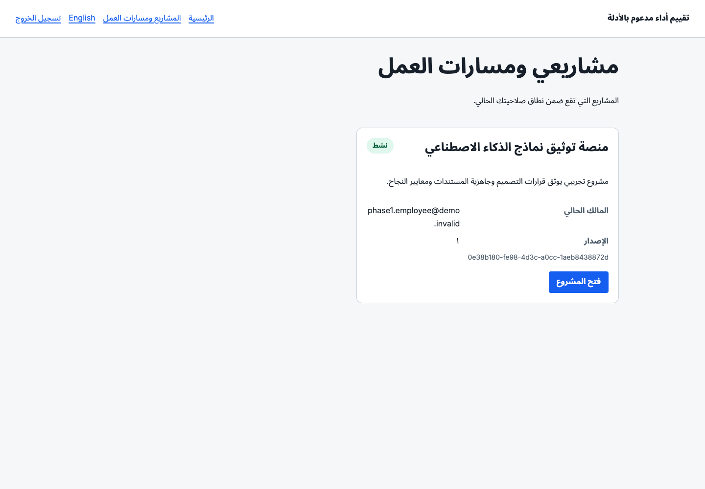
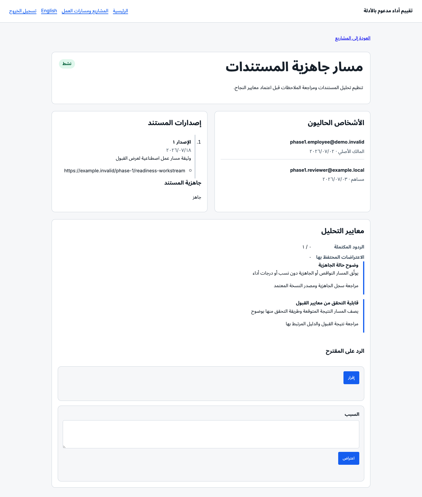
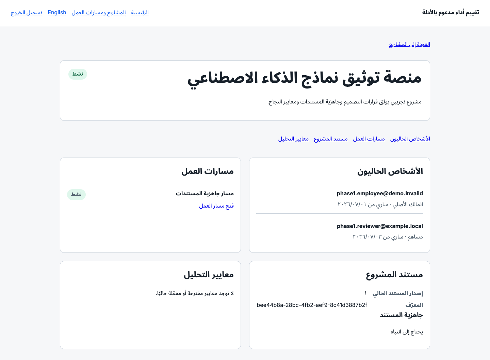
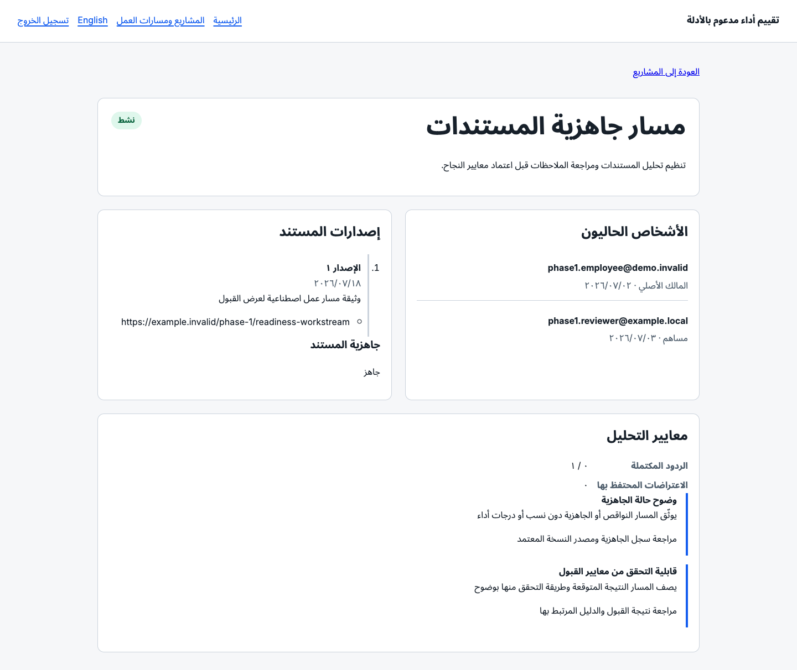
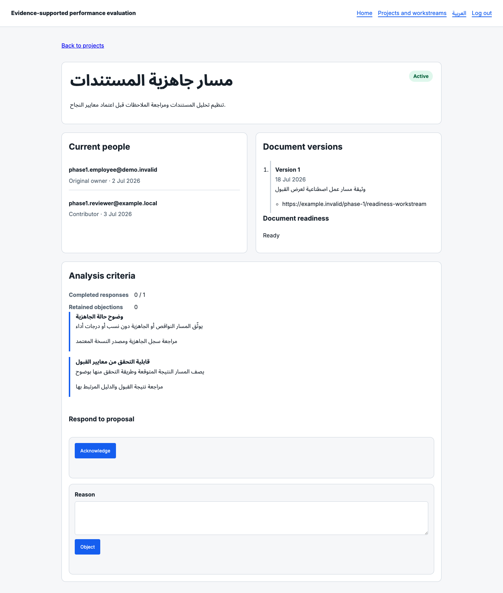

# Phase 1 Product Acceptance

## Acceptance status

Phase 1 is running locally for product-owner review. This artifact describes what can be reviewed now, the synthetic data used, exact URLs and accounts, Playwright evidence, and behavior that remains missing or partial.

- **Branch:** `codex/phase-1-projects-workstreams-documents`
- **Measured source commit:** `74866cb`
- **Local review date:** 2026-07-18
- **Pull Request:** #3, open and not merged
- **Phase 2:** not running and not included

## Running environment

The full local environment was started and verified:

| Component       | Address                 | Status                                    |
| --------------- | ----------------------- | ----------------------------------------- |
| Web application | `http://localhost:3000` | running                                   |
| API             | `http://127.0.0.1:3001` | running                                   |
| Worker          | `http://127.0.0.1:3002` | running                                   |
| Keycloak        | `http://127.0.0.1:8081` | healthy                                   |
| PostgreSQL      | local container         | healthy and isolated                      |
| Redis           | local container         | healthy; persistence marker retained      |
| MinIO           | local container         | healthy; private document bucket enforced |
| ClamAV          | local container         | healthy; malware fixture rejected         |

`pnpm infra:verify` passed all PostgreSQL, Redis, MinIO, ClamAV, and OIDC checks. The production web build also passed.

## Test accounts

All accounts use this local-only password:

```text
Phase1-Demo-2026!
```

| Sign-in identifier              | Role in the demo                                    | Intended review                                                          |
| ------------------------------- | --------------------------------------------------- | ------------------------------------------------------------------------ |
| `phase1.manager@demo.invalid`   | Department manager                                  | Department-scoped project/workstream access and coarse readiness state.  |
| `phase1.employee@demo.invalid`  | Employee; primary project and workstream owner      | Owner-scoped project/workstream access and criteria publication.         |
| `phase1.reviewer@example.local` | Employee; project member and workstream contributor | Employee flow and the visible contributor criteria response gate.        |
| `phase1.admin@demo.invalid`     | System administrator                                | Infrastructure/AI governance setup; Phase 1 has no administrator screen. |

Use the full email address shown above on the Keycloak sign-in screen.

## Exact URLs

| View                      | URL                                                                                                                       |
| ------------------------- | ------------------------------------------------------------------------------------------------------------------------- |
| Arabic project list       | `http://localhost:3000/ar/projects`                                                                                       |
| Arabic project detail     | `http://localhost:3000/ar/projects/0e38b180-fe98-4d3c-a0cc-1aeb8438872d`                                                  |
| Arabic workstream detail  | `http://localhost:3000/ar/projects/0e38b180-fe98-4d3c-a0cc-1aeb8438872d/workstreams/7a76e97b-b9aa-4559-b9b0-4df5cb074106` |
| English project list      | `http://localhost:3000/en/projects`                                                                                       |
| English workstream detail | `http://localhost:3000/en/projects/0e38b180-fe98-4d3c-a0cc-1aeb8438872d/workstreams/7a76e97b-b9aa-4559-b9b0-4df5cb074106` |

Unauthenticated navigation redirects through the local Keycloak sign-in flow.

## Synthetic acceptance data

The data is realistic but contains no real employee or customer information.

### People and responsibility

- Manager: `phase1.manager@demo.invalid`
- Primary owner: `phase1.employee@demo.invalid`
- Project member/workstream contributor: `phase1.reviewer@example.local`
- Responsibility periods begin on 1–3 July 2026 and remain active.

### Project

- **Name:** منصة توثيق نماذج الذكاء الاصطناعي
- **ID:** `0e38b180-fe98-4d3c-a0cc-1aeb8438872d`
- **Status:** active
- **Purpose:** document design decisions, document readiness, and success criteria for a pilot AI-model documentation platform.

### Workstream

- **Name:** مسار جاهزية المستندات
- **ID:** `7a76e97b-b9aa-4559-b9b0-4df5cb074106`
- **Status:** active
- **Purpose:** organize document analysis and human review before prospective criteria approval.

### Documents and readiness

| Scope      | Document ID                            | Version | Acceptance state              |
| ---------- | -------------------------------------- | ------: | ----------------------------- |
| Project    | `bee44b8a-28bc-4fb2-aef9-8c41d3887b2f` |       1 | needs attention               |
| Workstream | `233eb3f5-23ad-48ea-a0c1-a260a601ee5a` |       1 | ready for criteria generation |

The project fixture includes one missing qualitative acceptance measure. The workstream fixture is complete. No readiness percentage, readiness ranking, or performance score is stored or displayed.

### Criteria review

The workstream has two source-bound synthetic criteria:

1. وضوح حالة الجاهزية
2. قابلية التحقق من معايير القبول

The primary owner published the proposal through the real protected API. That publication created an immutable review snapshot containing the owner and the active contributor. The proposal is now in `contributor_review` with `0 / 1` required responses completed, so the product owner can sign in as `phase1.reviewer@example.local` and test either **إقرار** or **اعتراض**.

The proposal deliberately remains unsubmitted for acceptance review.

## How the data was created

The following operations used the real Phase 1 APIs:

- user synchronization;
- project and workstream creation;
- project membership and workstream contributor assignment;
- document-template creation and activation;
- document creation and version-source attachment;
- owner publication of the workstream criteria proposal.

Readiness analysis and the initial criteria-generation result were inserted as explicitly synthetic local acceptance fixtures so that:

- the demo is deterministic;
- no paid external model call is required;
- no real or sensitive content is sent to an AI provider.

The subsequent human publication, frozen eligibility snapshot, permissions, API serialization, web rendering, and response actions are the real application paths.

## Playwright evidence

All screenshots were captured from the running production web build at a 1440 × 1000 viewport.

### 1. Employee project list, Arabic



Shows the contributor's authorized project list, Arabic default locale, active project status, current owner, stable identifier, and RTL layout.

### 2. Employee project detail and document readiness


Shows current owner and contributor periods, child workstream navigation, current project document version, and a non-scoring “needs attention” readiness state.

### 3. Contributor workstream criteria review



Shows the active owner and contributor, document-version history, ready state, two proposed criteria, response completion `0 / 1`, retained-objection count, and the contributor's acknowledge/object forms.

### 4. Manager project readiness



Shows the manager's department-scoped project access. The manager receives only the operational “needs attention” state; no missing-item detail, percentage, readiness value, or ranking is displayed.

### 5. Manager workstream status



Shows the manager's read-only view of the ready workstream and criteria response progress. Contributor response controls are absent.

### 6. English locale



Shows the same stable resources and criteria state in the supported English locale.

The captured target screens reported zero browser console errors.

## Flow-by-flow acceptance guide

### Employee flow

1. Sign in as `phase1.reviewer@example.local`.
2. Open the Arabic project list.
3. Confirm only authorized projects are shown.
4. Open the project and verify current owner/member responsibility periods.
5. Open the child workstream.
6. Verify the employee can see the document version, detailed criteria, and contributor response controls.

### Manager flow

1. Sign out and sign in as `phase1.manager@demo.invalid`.
2. Open the project detail URL.
3. Confirm department-scoped access to the project, people, workstream, and document.
4. Confirm readiness is a coarse operational state only.
5. Open the workstream and confirm response progress is visible but contributor response controls are not.

### Project flow

1. Open the project detail URL.
2. Verify active status, current people, effective responsibility dates, project document version, and child workstream.
3. Confirm project readiness does not become a performance score.

### Workstream flow

1. Open the workstream detail URL.
2. Verify owner/contributor periods and versioned document source.
3. Confirm the workstream is independently ready while the parent project needs attention.

### Document-readiness flow

1. Compare the project and workstream pages.
2. Confirm the project shows “needs attention” and the workstream shows “ready”.
3. As manager, confirm no percentage or individual missing-item details are shown.
4. As employee/contributor, note that the current web page also renders only the state label; detailed correction data exists behind the protected API but is not yet surfaced in the Phase 1 UI.

### Criteria-review flow

1. Sign in as `phase1.reviewer@example.local`.
2. Open the Arabic workstream detail URL.
3. Review both source-bound proposed criteria.
4. Verify `0 / 1` completed responses and zero retained objections.
5. Choose **إقرار**, or enter a reason and choose **اعتراض**, only when ready to mutate the local acceptance state.

## Missing or partially implemented behavior

The following are not hidden by the demo:

1. **Project/workstream management UI is incomplete.** Phase 1 provides protected APIs for creation, membership, ownership, status, documents, and criteria, but the web UI is primarily read/review oriented and does not expose every management command.
2. **Document upload/version creation UI is not present.** The web view lists document versions and external sources; creation was performed through the API.
3. **Employee correction detail is not rendered.** The protected API can return missing items and source references to an authorized participant, but the current project page displays only the readiness label.
4. **Actual AI execution is not part of this acceptance fixture.** The fixture uses deterministic synthetic outputs. Provider routing, worker persistence, and AI evaluation tests exist separately, but this demo does not prove a live provider response.
5. **Artifact registration script currently rejects its own evidence reference.** `register-analysis-criteria-ai-artifacts.ts` supplies `ai-eval:analysis-criteria-v2`, which does not match the current opaque-reference schema. The local demo used clearly marked synthetic artifact rows as a workaround. No production fix was applied.
6. **Local environment loading is fragile.** `pnpm infra:up` selects one environment file. A secret-only `.env.local` therefore omits required infrastructure defaults; the successful run explicitly loaded `.env.example` followed by `.env.local`.
7. **Next.js reports a workspace-root warning.** The worktree and parent repository manifests are both detected. The production build succeeds, but tracing-root configuration should be clarified later.
8. **No administrator product screen exists in Phase 1.** Administrator governance operations are API/script based.
9. **The acceptance proposal is intentionally not completed or activated.** This preserves the contributor response gate for direct review.

## Verification evidence

| Verification                                         | Result                                                       |
| ---------------------------------------------------- | ------------------------------------------------------------ |
| Infrastructure verification                          | PASS                                                         |
| Production web build, typecheck, and page generation | PASS                                                         |
| Arabic project and workstream navigation             | PASS                                                         |
| English workstream navigation                        | PASS                                                         |
| Manager and employee OIDC login                      | PASS                                                         |
| Role-scoped action rendering                         | PASS                                                         |
| Playwright screenshots                               | 6 captured                                                   |
| Target-screen console errors                         | 0                                                            |
| Full local `pnpm test:coverage`                      | PASS: 80 files, 669 tests                                    |
| GitHub Actions `quality`                             | FAIL: repository boundary test timeout; see complexity audit |

## Acceptance boundary

Reviewing this demo does not merge Pull Request #3, authorize Phase 2, approve architecture simplification, or change any protected product rule. The next action remains direct product-owner review of the running flow, complexity metrics, and proposed simplifications.
