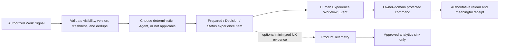

# AI-Native Event Taxonomy

**Status:** Closed Phase 0A definition; no production runtime contract or collection enabled  
**Machine source:** `ai-native-event-taxonomy.json`

## The Three Systems

| System                    | What it means                                                       | Can trigger assistance?                                 | Can become a protected fact?                                  |
| ------------------------- | ------------------------------------------------------------------- | ------------------------------------------------------- | ------------------------------------------------------------- |
| Work Signal               | A real, authorized domain/source/scheduled/user-domain change       | Yes, after authorization, dedupe, freshness, and policy | Only through the owning domain’s existing rules               |
| Experience Workflow Event | A human decision or recovery transition inside a bounded experience | Only by dispatching to the named owner-domain command   | Only the authoritative command result, never the click itself |
| Product Telemetry         | Minimized evidence for a specific UX/performance question           | Never                                                   | Never                                                         |

The same string cannot belong to more than one registry. Unknown Work Signals fail closed. A page
view, drawer open, hover, scroll, dwell, typing, focus, or navigation trail is never a Work Signal.

## Work Signals

The closed classes are:

- `domain`: authoritative change emitted by Projects, Work Items, Updates/Evidence, Research,
  Evaluation, Continuity, or another owner domain.
- `connector`: verified connector fact or private connector-state change under the connector’s
  visibility policy.
- `scheduled_work_check`: a bounded schedule that asks whether authorized source state needs
  composition or action.
- `user_domain_action`: an explicit capture, protected command, or assistance request—not raw UI
  interaction.

Every signal carries or derives a versioned source reference, scope, visibility, occurred time,
freshness, correlation, and dedupe identity before later runtime use. Unknown signal keys are rejected;
they do not fall through to a generic event handler.

## Experience Workflow Events

The closed decisions are `confirm`, `correct`, `dismiss`, `retry`, `submit`, and `recovery`. When a
decision changes domain state it must name the owner-domain command and carry the required expected
version and idempotency key. The frontend never turns an event into an arbitrary mutation.

## Product Telemetry

Phase 0A only records eligibility. Collection remains disabled until the later telemetry approval.
Eligible events answer bounded questions about Today availability, manual-fallback discovery,
recovery completion, prepared-item comprehension, capture completion, explicit preferences, and
surface response performance.

Telemetry must not contain or derive:

- hover, scroll, dwell, active time, search focus, or raw navigation trails;
- user content, connector bodies, private source URLs, prompts, or model output;
- ratings, readiness values, performance/progress conclusions, evidence facts, or employee ranks;
- a route into the Experience Orchestrator, autonomy policy, protected commands, Project progress,
  Evidence facts, Evaluation, or manager decisions.

## Processing Boundary

The dotted telemetry path is one-way and cannot re-enter the work/orchestration path.
