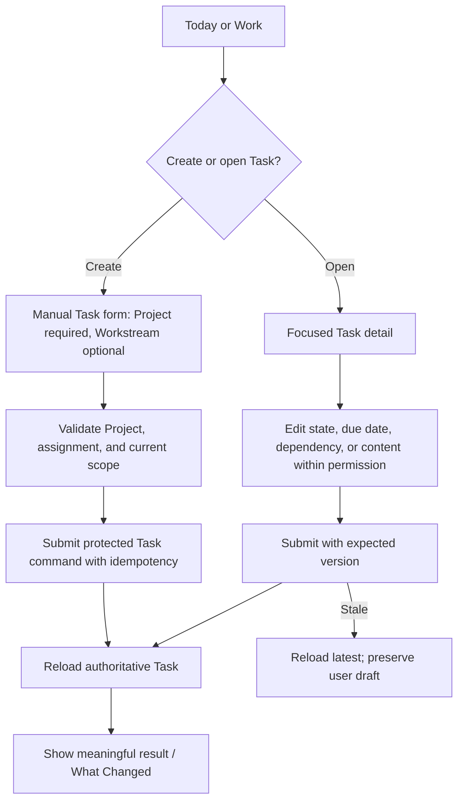
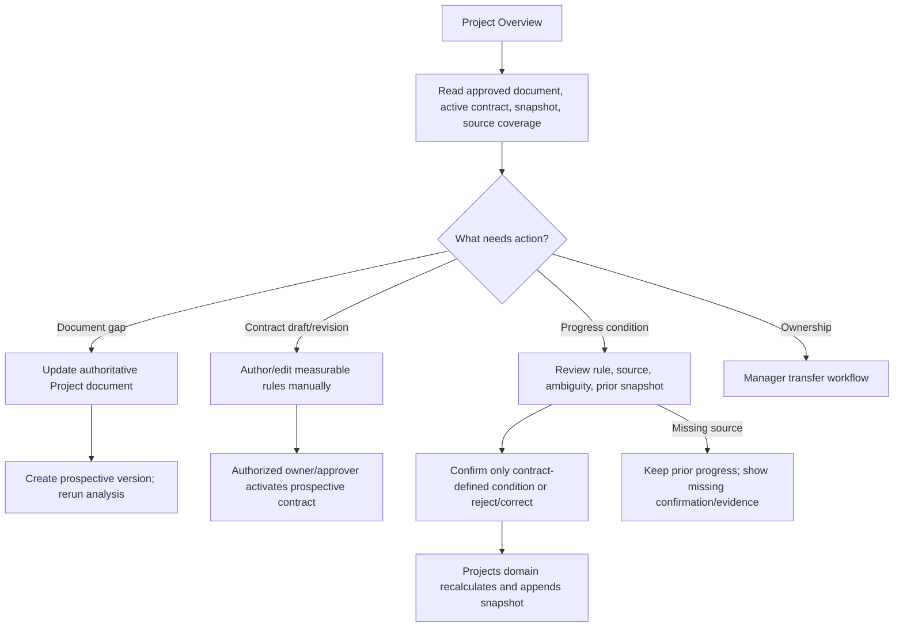
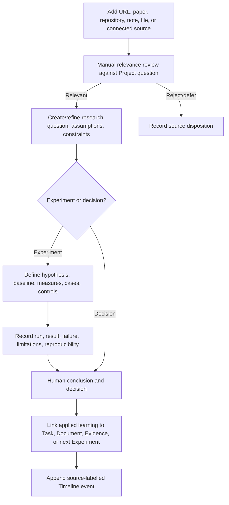
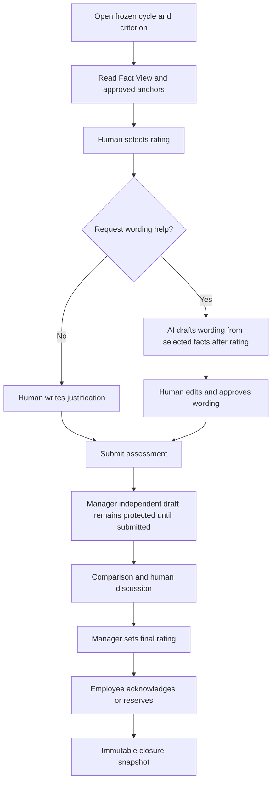
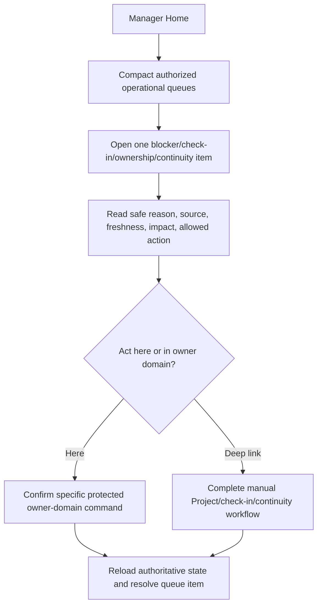
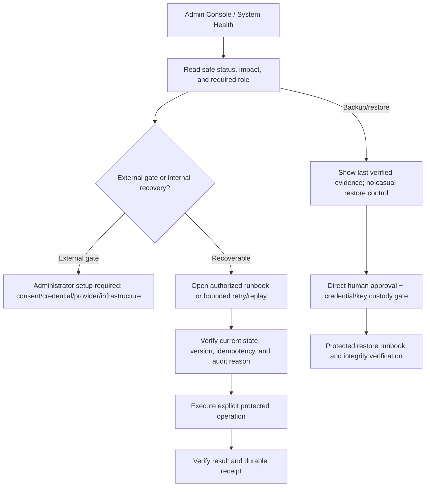

# AI-Native Manual and Operator Wireflows

**Status:** Phase 0A nonvisual workflow definition  
**Rule:** AI/Chat may shorten a path but cannot remove its complete manual or protected operator flow.

## Work

AI may prepare a draft or follow-up. The human chooses Project/assignment and submits. Task count or
completion never becomes Project progress or employee performance.

## Project

No direct percentage override exists. Activity volume never calculates progress.

## Research and Experiment

Failed/inconclusive results remain visible. AI may review or draft but cannot confirm relevance,
method, conclusion, decision, or applied learning.

## Evaluation — Fixed Human Flow

AI never selects, predicts, challenges, normalizes, or recommends a rating.

## Manager Operations

The queue excludes private connected context, private coaching, employee readiness percentages,
rankings, leaderboards, productivity scores, and predicted ratings.

## Admin and Operations Recovery

System Administrator does not become manager, does not decide permanent reassignment, and does not
receive unrestricted private business content.

## Shared Recovery Vocabulary

- **Your draft is safe:** Retry assistance or continue manually.
- **Needs your review:** A source or relationship is ambiguous.
- **Connection needs attention:** Reconnect without duplicating imported items.
- **Changed since you opened it:** Reload the latest version; history remains intact.
- **You do not have access:** Explain required role/scope without exposing the resource.
- **Service temporarily unavailable:** Bounded retry and safe support reference.
- **Administrator setup required:** The user cannot close an external credential/consent gate.
