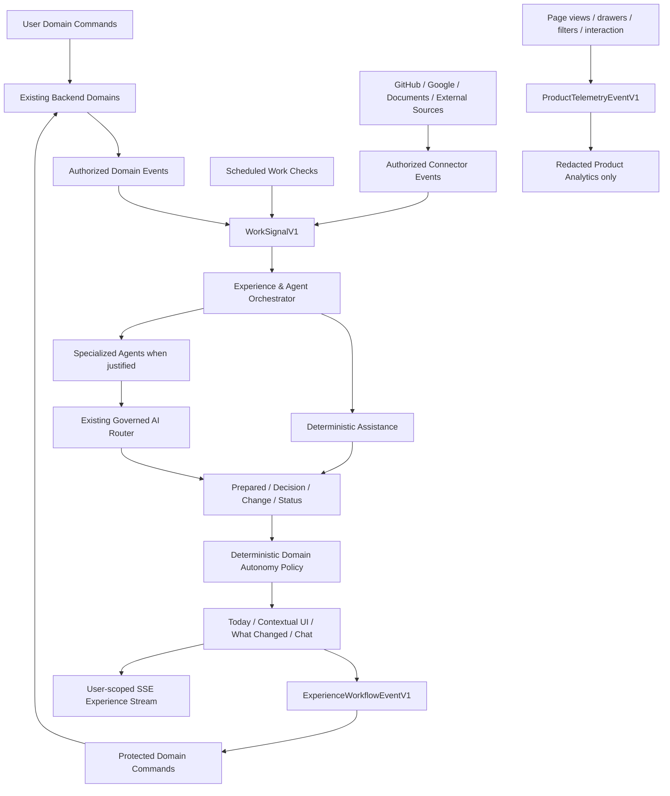

# الخطة التنفيذية المرجعية الشاملة

## AI‑Native Frontend & Proactive Agent Experience

**اسم المشروع:** AI‑Native Work Orchestration & Evidence‑Based Evaluation System  
**نوع الوثيقة:** Master Implementation Plan — المرجع الحاكم للبناء  
**الحالة:** `APPROVED — PHASE 0A EXECUTION PLANNING AUTHORIZED`  
**النطاق:** Frontend كامل للاستخدام الداخلي + طبقة Experience Composition + Proactive Agent Runtime، مع الإبقاء على الـBackend Domains الحالية كمصدر الحقيقة والتنفيذ  
**تاريخ الخطة:** 2026‑08‑11  
**Revision:** Final governance correction — source-backed matrix preserved; assistance modes, signal boundaries, D0/G0 split, IA hypothesis, and evolving Skill governance approved  
**خط الأساس المرجعي:** البناء يبدأ من `main` النظيف؛ لا يتم دمج الفرع التجريبي `experimental/clickup-multi-agent-ui` في الإنتاج  
**قاعدة التنفيذ:** كل Capability ذات واجهة تُبنى بمسار مستخدم أو مشغّل كامل، وAssistance Mode معلن ومبرر، وRecovery واختبارات حماية مناسبة. لا تُضاف Agent لمجرد إغلاق تعريف الاكتمال.

### Revision Note — Final Governance Correction

اعتمد Product Owner هذه المراجعة بوصفها التصحيح الحاكم الأخير قبل تخطيط تنفيذ Phase 0A. التغييرات الجوهرية هي:

1. تحويل الـSkills إلى **Execution Assets متطورة** تُكتشف وتُراجع حسب المهمة، وليست قائمة ثابتة داخل Product Architecture.
2. استبدال فرض Agent على كل Capability بنموذج **Assistance Modes** يفصل بين Proactive Agent، On-demand AI، Deterministic Assistance، Contextual Status/Recovery، Manual Only، وNot Applicable.
3. فصل **Work Signals** و**Experience Workflow Events** تقنيًا ومفاهيميًا عن **Product Telemetry**؛ Navigation وpage views لا تنشئ حقائق عمل ولا Commands.
4. تقسيم Phase 0 إلى **Phase 0A — Experience Definition and Governance** مع Gate `D0`، ثم **Phase 0B — Technical Frontend Foundation** مع Gate `G0`.
5. اعتبار Information Architecture الحالية **فرضية معتمدة للاختبار في D0**، لا شجرة تنقل نهائية قبل الاختبار.

لم تتغير حقائق الـEngine أو حالات الـ44 Capability أو الـBackend authority أو قيود Evaluation/Privacy. هذه المراجعة تغيّر فقط طريقة التسليم، الاكتمال، والتفعيل في الواجهة.

---

## 1. القرار التنفيذي

يتم بناء **واجهة داخلية كاملة قابلة للاستخدام اليومي** داخل التطبيق الحالي `apps/web`، بحيث تغطي جميع الـCapabilities ذات المعنى للمستخدم الموجودة في الـBackend، وتحوّل النظام من أداة ينتظر فيها الموظف أن يسأل الذكاء الاصطناعي إلى **نظام يبادر بفهم العمل ومتابعته وتحضير الأعمال الإدارية واقتراح الخطوة التالية**.

النموذج المستهدف هو:

> **Stable Product Shell + Familiar Work Management + Proactive Specialized Agents + Adaptive Content + Governed Automation + Full Manual Control**

المشروع ليس Chatbot، وليس نسخة ClickUp عليها زر AI، وليس Agent Playground. المنتج هو نظام عمل يومي:

- يستطيع الموظف إنجاز كل الإجراءات يدويًا؛
- يراقب النظام إشارات العمل المصرح بها؛
- يفهم ما حدث ضمن سياق Project/Task/Research/Evidence؛
- يحضّر التحديثات والروابط والمهام والمتابعات؛
- ينفذ الصيانة الآمنة تلقائيًا؛
- يطلب قرار الموظف فقط عند وجود غموض أو أثر يحتاج حكمًا بشريًا؛
- يتيح Chat للنقاش والاستفسار، دون أن يكون Chat هو مركز التجربة؛
- يبقى الـBackend الحالي هو صاحب الحقيقة والصلاحية والتنفيذ.

### قرارات ثابتة

1. البناء داخل `apps/web`، وليس في Frontend ثانٍ.
2. الـBackend Domains الحالية تبقى مالكة للبيانات والقواعد والـCommands.
3. الـAI Router الحالي يبقى مسؤولًا عن الـModels والـPrompts والـSchemas والـFallback.
4. تتم إضافة **Agent Orchestrator** وAgents متخصصة فوق الـAI Router، لا Router منافس له.
5. Chat مجرد قناة تتصل بنفس الـAgents والـBackend، وليس “Master Agent” مستقلًا.
6. لا Global Business Store في المتصفح.
7. الواجهة Stable، والمحتوى Adaptive؛ لا Generative Layout مفتوح أو JSX مولد من النموذج.
8. كل Backend Capability ذات معنى للمستخدم يجب أن تملك Manual أو Operator Surface واضحة حيث ينطبق.
9. كل Capability ذات واجهة تعلن Assistance Mode واحدًا أو أكثر، مع Owner وTrigger واضحين؛ لا تُضاف Agent لمجرد إكمال Checklist.
10. Work Signals وExperience Workflow Events وProduct Telemetry أنواع مستقلة بعقود وحدود Import مختلفة.
11. Navigation، page views، component opens، dwell behavior، وواجهة الاستخدام ليست Work Signals.
12. Evaluation وقرارات التقييم تبقى ثابتة وبشرية وغير قابلة للتوجيه أو الاختيار بواسطة AI.
13. Skills هي Execution Assets متطورة، وليست Product Architecture ثابتة، ولا تتقدم على `AGENTS.md` أو العقود أو CI.
14. لا يبدأ Production Shell أو Product Token System أو اعتماد Primitive Library أو Final Visual Components قبل نجاح Gate `D0`.
15. Information Architecture الحالية فرضية معتمدة للاختبار؛ تُثبّت في `D0` وفق الاستخدام الفعلي وDesktop/Mobile/RTL.

---

## 2. هدف المنتج

### 2.1 الهدف الأساسي

تقليل الوقت والجهد الذي يهدره الموظف في الأعمال الإدارية المرتبطة بالعمل الحقيقي، مثل:

- إنشاء أو تحديث Tasks بعد حدوث تغيير فعلي؛
- توثيق ما تم إنجازه؛
- ربط PR أو Source أو Document بالمشروع الصحيح؛
- إنشاء Update من العمل المنجز؛
- تذكير الموظف بالاعتماديات والمتابعات؛
- اكتشاف أن Research أو Experiment لم يتحول إلى قرار أو Action؛
- معرفة ما تغير في Project دون مراجعة عشر صفحات؛
- تحضير Facts وEvidence المطلوبة للتقييم؛
- تنظيم العمل اليومي وإزالة العناصر المحسومة من واجهة الموظف؛
- إبراز سؤال واحد يحتاج حكم الموظف بدل عرض عشر إشعارات.

### 2.2 تجربة النجاح المقصودة

عندما يفتح الموظف النظام، يجب أن يشعر أن النظام يقول له:

> لديك ثلاثة أعمال حقيقية اليوم.  
> أنجزت لك عمليتين إداريتين.  
> حضرت لك تحديثًا وربطًا بالمصدر.  
> لدي سؤال واحد فقط يحتاج قرارك.  
> تغير Project X لأن Dependency أُنجزت.  
> البحث الذي طلبته جاهز، لكن التجربة لم تبدأ بعد.  
> هذه هي الخطوة التالية الأكثر منطقية.

### 2.3 ما لا يدخل في الهدف

- مراقبة الشاشة أو ضغطات المفاتيح أو الوقت النشط.
- إنتاج Productivity Score أو Engagement Score.
- تحويل عدد Tasks أو Commits أو Updates إلى Progress أو Performance.
- إجبار الموظف على استخدام Chat لإنجاز العمل.
- بناء Product تجاري مكتمل للتسويق في هذه المرحلة.
- تقليد هوية ClickUp أو Notion بصريًا.
- منح الـAI صلاحيات بناءً على Confidence أو تكرار قبول المستخدم.

---

## 3. مبادئ المنتج الحاكمة

### 3.1 Manual First, Proactive by Default

كل إجراء متاح يدويًا، لكن النظام يبادر عندما يمتلك Signal وسياقًا كافيًا. لا يصبح تعطل AI أو Connector سببًا لتعطل العمل الأساسي.

### 3.2 Observe Work, Not People

النظام يراقب **إشارات العمل** المصرح بها، مثل GitHub، Tasks، Documents، Research، Experiments، Updates، Connected Sources، Project events، وليس سلوك الموظف الشخصي أو نشاطه على الجهاز.

### 3.3 Prepare Before Asking

قبل أن يطلب النظام من الموظف قرارًا، عليه أن ينفذ أكبر قدر آمن من العمل:

- يجمع السياق؛
- يحدد المصدر؛
- يحضر Draft؛
- يوضح سبب الاقتراح؛
- يحدد أثر القرار؛
- يطرح سؤالًا واحدًا محددًا عند الحاجة.

### 3.4 Few Decisions, Not More Cards

الهدف ليس إنشاء Inbox ذكي مليء بالـCandidates. يجب تقليل Confirmation Burden عبر:

- Auto Maintenance الصامتة؛
- دمج العناصر المتكررة؛
- إخفاء المحسوم؛
- عرض النتائج المنجزة في What Changed؛
- تجميع القرارات المرتبطة عندما لا يضيع ذلك الوضوح.

### 3.5 Stable Shell, Adaptive Content

أماكن التنقل والإجراءات الأساسية ثابتة. الذكاء يقرر **ما المحتوى الأكثر صلة داخل مناطق معروفة**، ولا يعيد اختراع الواجهة أو تغيير مواضع الأزرار الحساسة.

### 3.6 Domain Authority

الـAgent يحلل ويحضّر ويقترح، لكنه لا يصبح مالكًا لـTask أو Evidence أو Progress أو Evaluation. التنفيذ دائمًا عبر الـCommand المحمي في الـDomain المالكة.

### 3.7 Source‑Backed Intelligence

كل اقتراح مهم يوضح:

- ماذا لاحظ النظام؟
- من أي Source؟
- ما السياق المرتبط؟
- لماذا ظهر الآن؟
- ما الذي سيحدث عند القبول؟
- هل المعلومات Fresh أم Stale؟

### 3.8 Internal Beta with Engineering Visibility

بما أن المستخدمين الأوائل تقنيون، توفر النسخة الداخلية Inspection Mode يساعد الفريق على تشخيص الاقتراحات، دون كشف Chain‑of‑Thought أو Secrets أو محتوى خاص غير مصرح به.

### 3.9 Assistance by Need, Not by Checklist

القيمة قد تأتي من Agent، أو قواعد حتمية، أو Status/Recovery واضح، أو مسار بشري ثابت. Deterministic Assistance ليست درجة أدنى من Agent Assistance. لا نضيف LLM أو Agent عندما تكون القواعد أو الحالة الصريحة أكثر أمانًا ووضوحًا.

### 3.10 Work Signals Are Not Product Telemetry

Work Signal يحمل معنى عمل أو Domain/Source meaning حقيقيًا. أما فتح صفحة أو Drawer أو تغيير Filter فهو Product Telemetry مؤهل للتحليل فقط إذا تم اعتماده، ولا يصبح حقيقة عمل أو مصدرًا للـProgress أو Evaluation أو Manager decisions أو Autonomy.

### 3.11 Experience Approval Before Production Foundation

تُعتمد لغة المنتج، IA hypothesis، Today، الحالات الذكية، السلوك المتجاوب، والـRTL في Gate `D0` قبل بناء Production Shell أو Tokens أو Product Components نهائية. يسمح فقط بـisolated non-production feasibility spikes تساعد القرار ولا تُعتمد تلقائيًا.

### 3.12 Skills as Evolving Execution Assets

تُكتشف Skills وتُقيّم حسب تعقيد ومخاطر المهمة والبيئة المتاحة. قد تستخدم Skill لمهمة واحدة دون إضافتها للمستودع. تتحول إلى Project-owned Skill فقط بعد إثبات تكرارها وقيمتها وقابليتها للاختبار ووجود Ownership وVersioning وDeprecation واضح.

---

## 4. تعريف الاكتمال بالنسبة للـBackend

### 4.1 Source-of-Truth Snapshot

هذه المصفوفة لم تُبنَ من الذاكرة أو من شجرة الـpackages أو من الشاشات المؤقتة. تم تثبيتها من المستودع الخاص:

| العنصر                          | القيمة المرجعية                                                                                    |
| ------------------------------- | -------------------------------------------------------------------------------------------------- |
| Repository                      | `Haithamhaj/evidence-performance-evaluation-system`                                                |
| Current `main` head             | `2eee638958294b790c75375d564d5c03188062f2` — `docs: complete engine integration handoff (#27)`     |
| Verified engine baseline        | `a631eaa81a5b462f329e5917c5be3301281f970a`                                                         |
| Authoritative capability ledger | `docs/product/ENGINE_FEATURE_REGISTER.md` — blob `0e462d5af380160b2fa0ad7c871c319dce2e08d4`        |
| Reconciled status matrix        | `docs/product/ENGINE_CAPABILITY_MATRIX.md` — blob `aa04a6ac3f310eb195b3d13e7885897716574601`       |
| Journey authority               | `docs/product/ENGINE_CUSTOMER_JOURNEY_MAP.md` — blob `39aed072a9c74135b2a28a1c962202ff3a0836bf`    |
| Frontend handoff schema         | `docs/product/ENGINE_FRONTEND_HANDOFF_SCHEMA.md` — blob `c3978600b1c9cfc88a3dc1b7682f5606e1718ca9` |
| Source audit date               | `2026-08-10`                                                                                       |
| Plan integration date           | `2026-08-11`                                                                                       |

حالة السجل المصالح:

| Source status       |  Count | Frontend interpretation                                                              |
| ------------------- | -----: | ------------------------------------------------------------------------------------ |
| `COMPLETE`          |     39 | الـEngine contract موجود ومتحقق تقنيًا؛ لا يعني أن تجربة الـFrontend النهائية موجودة |
| `PARTIAL`           |      2 | CAP-004 وCAP-044؛ يوجد قيد بشري/إطلاق متبقٍ                                          |
| `EXTERNAL_GATE`     |      2 | CAP-019 وCAP-021؛ الـEngine موجود لكن الربط الحي يحتاج إعدادًا خارجيًا               |
| `DEFERRED_APPROVED` |      1 | CAP-034 خارج Pilot باعتماد صريح                                                      |
| **Total**           | **44** | لا توجد Capability بحالة `PLANNED`                                                   |

**قاعدة السلطة:**  
حقول **ID، الاسم الرسمي، Source status، Domain owner، Personas، Engine contract، AI prohibition، Human gate، والـExternal gate** تُحكم بواسطة `ENGINE_FEATURE_REGISTER.md`. أما **Target surface، Assistance Mode، Assistance Owner، Trigger/Activation، Experience projection، Delivery phase، وFrontend acceptance** فهي قرارات هذه الخطة. عند تعارضهما لا تعدل الواجهة حقيقة المحرك؛ يتم تحديث السجل أو الخطة صراحةً عبر Change Control.

### 4.2 Frontend Coverage Record

المصفوفة أدناه هي خط الأساس المعبأ للقدرات الأربع والأربعين. عند بدء تنفيذ Capability، يتحول صفها إلى Handoff Record تفصيلي وفق `ENGINE_FRONTEND_HANDOFF_SCHEMA.md` ويضيف:

| الحقل التنفيذي                 | المطلوب عند فتح الـCapability للتنفيذ                                                                       |
| ------------------------------ | ----------------------------------------------------------------------------------------------------------- |
| User moment and primary action | اللحظة الفعلية وأصغر Action مفيد، أو Operator workflow عندما تكون Capability تشغيلية                        |
| Information priority           | Must see / On demand / Technical hidden                                                                     |
| Exact read contract            | Public API/query/projection المصرح، لا قراءة مباشرة للجداول                                                 |
| Exact write contract           | Protected command، expected version، idempotency، reason                                                    |
| Assistance classification      | Mode(s) لكل user moment/action، والـOwner، والـTrigger/Activation؛ لا يُفترض Mode واحد لكل أفعال Capability |
| State model                    | Loading / Ready / Draft / Pending / Confirmed / Stale / Blocked / Failed / Completed                        |
| Work Signal                    | Domain/Connector/Scheduled/User Domain meaning فقط، مع dedupe وvisibility وfreshness                        |
| Experience Workflow Event      | confirm/correct/dismiss/retry/draft lifecycle عندما يغير Experience state أو يستدعي Command                 |
| Product Telemetry              | أحداث واجهة مؤهلة فقط، بعقد منفصل ولا Route منها إلى Orchestrator أو protected facts                        |
| SSE/experience projection      | الحدث المصرح الذي يحدّث السياق، مع dedupe وإعادة الاتصال؛ ليس كل Telemetry event يُبث                       |
| Recovery                       | ما الذي يُحفظ، وكيف تتم Retry/Reconnect/Conflict resolution                                                 |
| Responsive/RTL/accessibility   | 390px، desktop، Arabic/English، bidi، keyboard، focus، reduced motion                                       |
| Protected visibility           | الحقول المسموحة والممنوعة لكل Persona                                                                       |
| History/audit/telemetry        | Meaningful history المرئي مقابل protected audit مقابل minimized product analytics                           |
| Acceptance evidence            | Contract، integration، authorization negatives، AI eval عند الانطباق، E2E، screenshots، owner acceptance    |

### 4.2.1 Assistance Modes المعتمدة

| Mode                           | متى يستخدم                                                                               |
| ------------------------------ | ---------------------------------------------------------------------------------------- |
| `Proactive Agent Assistance`   | توجد Work Signals وسياق يحتاج فهمًا أو ربطًا أو تلخيصًا أو Draft استباقيًا               |
| `On-demand AI Assistance`      | يطلب المستخدم أو المشغّل مساعدة AI صراحةً داخل Workflow، دون مبادرة تلقائية              |
| `Deterministic Assistance`     | القواعد الحتمية توفر القيمة بأمان ووضوح دون LLM                                          |
| `Contextual Status & Recovery` | القيمة هي عرض الحالة والأثر والخطوة الآمنة التالية أو الاستعادة                          |
| `Manual Only`                  | القرار أو الإجراء يبقى بشريًا/تشغيليًا؛ قد تعرض الواجهة Facts أو Status دون أن تختاره AI |
| `Not Applicable`               | لا توجد فائدة Product أو تقنية من Assistance في الـPilot أو الـSurface غير موجودة أصلًا  |

لا نكرر كل تفاصيل سجل المحرك نصيًا داخل الخطة حتى لا تنشأ نسختان متعارضتان. الصف المعبأ يثبت **التغطية والملكية ومسار التسليم**، بينما يبقى سجل المحرك مرجع تفاصيل التنفيذ والاختبارات الحالية. التصنيف في الصف Summary على مستوى Capability؛ الـHandoff Record يفصله لكل user moment وaction.

### 4.3 Populated Frontend Capability Coverage Matrix

تحافظ المصفوفة على حقائق المصدر كما هي، وتضيف ثلاثة أبعاد تنفيذية منفصلة: **Assistance Mode(s)**، و**Assistance Owner**، و**Trigger / Activation**. لا يعني Summary الصف أن كل Action داخل Capability يشارك الوضع نفسه؛ التفصيل النهائي يتم في Handoff Record لكل user moment وaction.

#### 4.3.1 Governance, identity, AI, and runtime foundation

| ID        | Official capability / Source status                           | Source owner / Personas                                                                   | Target manual surface                              | Assistance mode(s) and behavior                                                                                                  | Assistance owner                                         | Trigger / Activation                                                                 | Autonomy / Human gate                                                 | Engine contract anchor                              | Delivery / Gate                                           |
| --------- | ------------------------------------------------------------- | ----------------------------------------------------------------------------------------- | -------------------------------------------------- | -------------------------------------------------------------------------------------------------------------------------------- | -------------------------------------------------------- | ------------------------------------------------------------------------------------ | --------------------------------------------------------------------- | --------------------------------------------------- | --------------------------------------------------------- |
| `CAP-001` | **Sign-in and synchronized identity**<br>`COMPLETE`           | `@evaluation/auth` + web auth routes<br>All authenticated users; IdP admin                | Sign-in / Session recovery / Profile               | **Contextual Status & Recovery**<br>Detect expired/deactivated session; route to calm recovery.                                  | Auth/session domain                                      | Session expiry, deactivation, callback failure, or explicit user retry               | Observe; **Human Only** for IdP setup                                 | `GET /api/v1/me`; auth login/callback/logout        | **P1 + P8**<br>Production OIDC client/realm configuration |
| `CAP-002` | **Server authorization and protected audit**<br>`COMPLETE`    | `@evaluation/permissions`, `@evaluation/audit`<br>All roles; Admin for audit              | Cross-cutting authorization; Admin > Audit         | **Deterministic Assistance + Contextual Status & Recovery**<br>Explain denial and required scope without exposing the resource.  | Permissions and Audit domains                            | Protected request, denied access, or authorized audit read                           | Observe; **Human Only** for protected mutations/override reasons      | Policy guards; `GET /audit`                         | **P0A–P9**<br>No external gate                            |
| `CAP-003` | **Governed AI routing**<br>`COMPLETE`                         | `@evaluation/ai-routing`<br>Admin configures; all AI-enabled features consume             | Admin > AI Routes; Inspection Mode                 | **Deterministic Assistance + Contextual Status & Recovery**<br>Select approved route/schema/fallback and expose safe run state.  | Governed AI Router + Experience Orchestrator             | AI-enabled request, route-resolution request, or approved route-configuration change | Observe/Prepare; **Human Only** for route configuration/override      | AI router/runtime contracts; AI run trace           | **P1 + P8**<br>Live provider key/model availability       |
| `CAP-004` | **Localization, RTL, and rubric locale control**<br>`PARTIAL` | `@evaluation/localization` + web locale shell<br>All users; rubric approver               | Global shell / Language settings / Evaluation gate | **Deterministic Assistance**<br>Preserve locale and bidi context in every prepared result.                                       | Localization platform; consumed by all assistance owners | Locale route/change, catalog render, or localized AI-output request                  | Auto Maintenance for presentation; **Human Only** for rubric approval | Locale routes, catalogs, versioned rubric locale    | **P0A–P9**<br>T016 Arabic evaluation semantic approval    |
| `CAP-005` | **Durable jobs and operational receipts**<br>`COMPLETE`       | API/worker queue infrastructure + DB operations<br>All users indirectly; Operations/Admin | Inline job state / What Changed / Admin operations | **Deterministic Assistance + Contextual Status & Recovery**<br>Push queued/working/retry/failure/success states; dedupe replays. | Experience Orchestrator + worker/operations services     | Durable-job lifecycle event, retry, replay, or authorized operator request           | Auto Maintenance; **Human Only** for administrative replay            | Versioned job envelopes; worker consumers; receipts | **P1 + P8**<br>Production Redis/worker deployment         |

#### 4.3.2 Projects, documents, criteria, and progress

| ID        | Official capability / Source status                                      | Source owner / Personas                                                                                        | Target manual surface                                  | Assistance mode(s) and behavior                                                                                                         | Assistance owner                          | Trigger / Activation                                                                          | Autonomy / Human gate                                                    | Engine contract anchor                                             | Delivery / Gate                                                               |
| --------- | ------------------------------------------------------------------------ | -------------------------------------------------------------------------------------------------------------- | ------------------------------------------------------ | --------------------------------------------------------------------------------------------------------------------------------------- | ----------------------------------------- | --------------------------------------------------------------------------------------------- | ------------------------------------------------------------------------ | ------------------------------------------------------------------ | ----------------------------------------------------------------------------- |
| `CAP-006` | **Projects, Workstreams, membership, and ownership**<br>`COMPLETE`       | `@evaluation/projects`<br>Manager, Project/Workstream owners, contributors                                     | Projects / Project settings / Members                  | **Proactive Agent Assistance + On-demand AI Assistance**<br>Surface missing context, ownership gaps, and relevant Project actions.      | Project Agent                             | Project/workstream/membership/ownership domain event or authorized user request               | Observe/Prepare; **Human Only** for creation, membership, assignment     | Projects and Workstreams controllers                               | **P3**<br>No external gate                                                    |
| `CAP-007` | **Responsibility windows and owner transfer**<br>`COMPLETE`              | `@evaluation/projects`<br>Manager; owners/employees as readers                                                 | Project > Ownership history; Manager queue             | **Proactive Agent Assistance + Deterministic Assistance**<br>Detect expiring/gapped responsibility and prepare transfer context.        | Project Agent + Manager Operations Agent  | Responsibility change, scheduled expiry/gap check, or transfer request                        | Prepare; **Human Only** for transfer                                     | Responsibilities controller                                        | **P3 + P7**<br>No external gate                                               |
| `CAP-008` | **Safe documents, templates, versions, and private files**<br>`COMPLETE` | `@evaluation/documents`<br>Authorized Project/Workstream participants and managers                             | Project > Documents / Upload / Version history         | **Proactive Agent Assistance + Deterministic Assistance**<br>Extract safe metadata, detect new versions, and prepare review context.    | Project Agent + Evidence & Research Agent | Document upload/version event, scan result, or authorized review request                      | Observe/Prepare; Confirm corrections; **Human Only** template activation | Document/template/upload controllers                               | **P3 + P4**<br>Production object store and ClamAV                             |
| `CAP-009` | **Document readiness and material-change analysis**<br>`COMPLETE`        | `@evaluation/documents` + analysis worker<br>Employee/owner; manager-safe projection                           | Project Overview / Documents / Today gaps              | **Proactive Agent Assistance + On-demand AI Assistance**<br>Analyze version change, show missing sections and one next correction.      | Project Agent                             | Material document change, analysis-job completion, or authorized review request               | Observe/Prepare; Confirm human correction/review                         | Document analysis controller and jobs                              | **P3 + P4**<br>Live model route availability; never expose readiness as score |
| `CAP-010` | **Dynamic Project and Workstream criteria**<br>`COMPLETE`                | `@evaluation/criteria`<br>Employee, owners, contributors, manager resolver                                     | Project > Criteria review and versions                 | **Proactive Agent Assistance + On-demand AI Assistance**<br>Prepare source-bound criteria and highlight objections/response gaps.       | Project Agent                             | Criteria draft/revision/objection event or authorized drafting request                        | Prepare/Confirm; **Human Only** activation and bounded resolution        | Criteria controller and public criteria readers                    | **P3**<br>Model availability only; no retroactive activation                  |
| `CAP-011` | **Project/Workstream Progress Contract**<br>`COMPLETE`                   | `@evaluation/projects`<br>Project/Workstream owner, approver, contributors                                     | Project > Progress Contract setup/review               | **On-demand AI Assistance + Proactive Agent Assistance**<br>Draft measurable contract from approved document; explain source basis.     | Project Agent                             | Approved document/contract-context change or authorized draft request                         | Prepare/Confirm; **Human Only** approval/activation                      | Progress-contract draft controller and progress services           | **P3**<br>No external gate                                                    |
| `CAP-012` | **Operational Project progress and snapshots**<br>`COMPLETE`             | `@evaluation/projects` + governed source readers<br>Contributors, owners/approvers, manager operational reader | Project Overview / Progress / Timeline / Manager queue | **Deterministic Assistance + Proactive Agent Assistance**<br>Detect contract-matching facts, prepare progress proposal, flag ambiguity. | Project Agent + progress domain service   | Governed source fact, Contract/snapshot change, scheduled check, or authorized review request | Observe/Prepare; Confirm measurable/qualitative change                   | Daily-work Project/readiness endpoints; progress query/calculation | **P3**<br>Live sources may be externally gated; no volume-based progress      |

#### 4.3.3 Daily work, capture, updates, and Evidence

| ID        | Official capability / Source status                                         | Source owner / Personas                                                                                             | Target manual surface                              | Assistance mode(s) and behavior                                                                                                                             | Assistance owner                       | Trigger / Activation                                                                     | Autonomy / Human gate                                                                   | Engine contract anchor                                     | Delivery / Gate                                                                                                    |
| --------- | --------------------------------------------------------------------------- | ------------------------------------------------------------------------------------------------------------------- | -------------------------------------------------- | ----------------------------------------------------------------------------------------------------------------------------------------------------------- | -------------------------------------- | ---------------------------------------------------------------------------------------- | --------------------------------------------------------------------------------------- | ---------------------------------------------------------- | ------------------------------------------------------------------------------------------------------------------ |
| `CAP-013` | **Work Items and normal task lifecycle**<br>`COMPLETE`                      | `@evaluation/work-items`<br>Employees, owners, authorized managers                                                  | Today / Work List / Board / Calendar / Task detail | **Deterministic Assistance + Proactive Agent Assistance**<br>Detect dependencies and completed work; prepare follow-up Task/status action.                  | Work Agent                             | Work-item lifecycle/dependency event, scheduled due check, or user domain command        | Observe/Prepare/Auto Maintenance; Confirm AI draft; **Human Only** protected assignment | Work Items controller                                      | **P1–P2**<br>No external gate                                                                                      |
| `CAP-014` | **Today, Needs My Action, and private Inbox**<br>`COMPLETE`                 | `@evaluation/work-items` + daily composition API<br>Employee/contributor                                            | Today / Universal Capture / Private Inbox          | **Deterministic Assistance + Proactive Agent Assistance**<br>Compose Needs Decision, Prepared, Today, Continue, What Changed; dedupe/retire resolved items. | Work Agent                             | Authorized Today read, work-domain event, scheduled refresh, or private Inbox command    | Observe/Prepare/Auto Maintenance; Confirm promote/link/dismiss                          | Private inbox controller; `GET /api/v1/daily-work/my-work` | **P1–P2**<br>Owner-only private Inbox                                                                              |
| `CAP-015` | **Fast text/code/file update lifecycle**<br>`COMPLETE`                      | `@evaluation/updates-evidence`<br>Employee/contributor                                                              | Global Capture / Task or Project update sheet      | **On-demand AI Assistance + Proactive Agent Assistance**<br>Ask one missing question, structure draft, preserve raw input, suggest links.                   | Work Agent → Evidence & Research Agent | User update-domain command, saved raw input, or source-link opportunity after submission | Prepare; Confirm employee edit/submission                                               | Updates controller and services                            | **P4**<br>Live AI route for production structuring                                                                 |
| `CAP-016` | **Voice update**<br>`COMPLETE`                                              | `@evaluation/updates-evidence`<br>Employee/contributor                                                              | Mobile/desktop voice capture sheet                 | **On-demand AI Assistance**<br>Transcribe, preserve source audio, and continue into the Update draft.                                                       | Work Agent + voice service             | User voice-capture/upload command or transcription retry                                 | Prepare; Confirm transcript edit and Update submission                                  | Voice controller and services                              | **P4**<br>Live speech-capable model                                                                                |
| `CAP-017` | **Evidence, contribution attribution, and Activity Timeline**<br>`COMPLETE` | `@evaluation/updates-evidence`<br>Employee/contributor; authorized owners/managers as readers                       | Today review / Evidence / Task / Project Timeline  | **Proactive Agent Assistance + On-demand AI Assistance**<br>Prepare description, source links, attribution and relationship suggestions.                    | Evidence & Research Agent              | Verified source/update/domain event or authorized Evidence review request                | Prepare; **Confirm** employee attribution/evidence; verification remains explicit       | Evidence and Timeline controllers/readers                  | **P4**<br>Connector-specific source gates; never convert activity volume to score                                  |
| `CAP-018` | **Thursday check-ins and monthly documentation readiness**<br>`COMPLETE`    | `@evaluation/updates-evidence` + daily-work composition<br>Workstream/Project owners, employee, manager-safe reader | Today / Project readiness / Manager safe queue     | **Deterministic Assistance + Proactive Agent Assistance**<br>Require check-in only when substantive update is absent; summarize actionable gaps.            | Work Agent + Project Agent             | Scheduled Thursday/monthly check, substantive-update event, or owner check-in command    | Observe/Auto Maintenance/Prepare; Confirm owner check-in                                | Daily-work check-in/readiness endpoints                    | **P1 + P3 + P7**<br>CAP-037 continuity is complete; source wording about a pending leave engine must be reconciled |

#### 4.3.4 Connected context, GitHub, manager operations, and Fact View

| ID        | Official capability / Source status                                        | Source owner / Personas                                                                                           | Target manual surface                                  | Assistance mode(s) and behavior                                                                                                                         | Assistance owner                                    | Trigger / Activation                                                                           | Autonomy / Human gate                                                 | Engine contract anchor                                                | Delivery / Gate                                                                             |
| --------- | -------------------------------------------------------------------------- | ----------------------------------------------------------------------------------------------------------------- | ------------------------------------------------------ | ------------------------------------------------------------------------------------------------------------------------------------------------------- | --------------------------------------------------- | ---------------------------------------------------------------------------------------------- | --------------------------------------------------------------------- | --------------------------------------------------------------------- | ------------------------------------------------------------------------------------------- |
| `CAP-019` | **Google Workspace connection and private context**<br>`EXTERNAL_GATE`     | `@evaluation/connected-work-context`<br>Employee only; Admin for connection setup                                 | Settings > Connections / Private context review        | **Contextual Status & Recovery + Proactive Agent Assistance**<br>Sync compact metadata, flag stale connection, and prepare private Project-link review. | Work Agent + connected-context domain               | Connector sync/revocation/staleness event, OAuth result, or employee review request            | Observe/Prepare; Confirm link/exclude; **Human Only** OAuth consent   | Connected-work controllers                                            | **P2 + P8**<br>Production Google OAuth approval, admin consent, redirects, credential vault |
| `CAP-020` | **Context Intelligence and confirmed Task drafts**<br>`COMPLETE`           | `@evaluation/context-intelligence`<br>Employee                                                                    | Today > Prepared for You / Context review / Task draft | **Proactive Agent Assistance + On-demand AI Assistance**<br>Suggest Project with reason/confidence, learn corrections, prepare Task draft.              | Work Agent                                          | Authorized connected-context event, employee correction, or Task-draft request                 | Prepare; **Confirm** Project link/correction and Task creation        | Context analysis and Task draft controllers                           | **P1–P2**<br>Real source context depends on CAP-019                                         |
| `CAP-021` | **GitHub App ingestion and reconciliation**<br>`EXTERNAL_GATE`             | `@evaluation/github-integration`<br>Admin/Project owner setup; employees consume source facts                     | Settings/Project > Connections health; Inspection Mode | **Deterministic Assistance + Contextual Status & Recovery**<br>Ingest signed events, dedupe, reconcile missed events, emit source-ready signal.         | GitHub integration domain + Experience Orchestrator | Signed webhook, scheduled reconciliation, installation/binding state change, or operator retry | Observe/Auto Maintenance; **Human Only** install/bind/rules           | GitHub webhook controller and reconciliation services                 | **P1 + P4 + P8**<br>GitHub App creation/install, webhook secret, org approval, live token   |
| `CAP-022` | **GitHub suggested evidence and governed progress proposal**<br>`COMPLETE` | `@evaluation/github-integration` + Evidence/Projects interfaces<br>Employee; Project owner for ambiguous progress | Today / Evidence review / Project Progress             | **Proactive Agent Assistance**<br>Convert verified GitHub fact into evidence suggestion and bounded progress proposal.                                  | Evidence & Research Agent + Project Agent           | Verified GitHub source fact emitted by CAP-021                                                 | Prepare; **Confirm** evidence and ambiguous progress                  | Evidence suggestion service; governed source reader; progress matcher | **P1 + P3 + P4**<br>Live input depends on CAP-021; never label as verified performance      |
| `CAP-023` | **Manager operational queues**<br>`COMPLETE`                               | Daily-work composition over public domain readers<br>Manager; contributor actions only when separately authorized | Manager Home / Queue item detail                       | **Deterministic Assistance + Proactive Agent Assistance**<br>Summarize blocker/reason and prepare the smallest authorized intervention.                 | Manager Operations Agent + owner-domain readers     | Authorized manager queue read or blocker/ownership/continuity domain event                     | Observe/Prepare; Confirm/Human Only according to owner-domain command | `GET /api/v1/daily-work/manager/operations`                           | **P7**<br>No employee score, rank, readiness percentage, or leaderboard                     |
| `CAP-024` | **Neutral Evaluation Fact View**<br>`COMPLETE`                             | `@evaluation/evaluation-preparation`<br>Employee self-assessment reader; authorized manager reader                | Evaluation > Fact View                                 | **Deterministic Assistance + On-demand AI Assistance**<br>Compose and normalize source facts; show coverage gaps and separate interpretation.           | Evaluation Preparation Agent + Fact View service    | Evaluation lifecycle state, confirmed-fact change, or authorized Fact View request             | Observe/Prepare only; rating remains Human Only in CAP-029/030        | `GET /api/v1/evaluation-cycles/:cycleId/employees/:employeeId/facts`  | **P6**<br>Manager never receives protected readiness values                                 |

#### 4.3.5 Research, Experiments, and Evaluation

| ID        | Official capability / Source status                                                                      | Source owner / Personas                                                                                            | Target manual surface                                        | Assistance mode(s) and behavior                                                                                                                                         | Assistance owner                         | Trigger / Activation                                                                | Autonomy / Human gate                                                            | Engine contract anchor                                                       | Delivery / Gate                                                                       |
| --------- | -------------------------------------------------------------------------------------------------------- | ------------------------------------------------------------------------------------------------------------------ | ------------------------------------------------------------ | ----------------------------------------------------------------------------------------------------------------------------------------------------------------------- | ---------------------------------------- | ----------------------------------------------------------------------------------- | -------------------------------------------------------------------------------- | ---------------------------------------------------------------------------- | ------------------------------------------------------------------------------------- |
| `CAP-025` | **Research question and technical exploration workspace**<br>`COMPLETE (technical checkpoint)`           | `@evaluation/research-experiments`<br>Employee/research contributor; authorized owner/manager reader               | Research workspace / Project Research                        | **Proactive Agent Assistance + On-demand AI Assistance**<br>Review source relevance, draft framing/synthesis, surface uncertainty and next test.                        | Evidence & Research Agent                | Research/source revision event, authorized source review, or synthesis request      | Observe/Prepare; Confirm source disposition, framing, synthesis, conclusion      | Protected Research, source-review, revision, synthesis and conclusion routes | **P5**<br>Live private/licensed source access requires approved connector/credentials |
| `CAP-026` | **Experiment and evaluation lifecycle**<br>`COMPLETE (technical checkpoint)`                             | `@evaluation/research-experiments`<br>Employee/experiment contributors; authorized readers                         | Experiment workspace / Research progression                  | **Proactive Agent Assistance + On-demand AI Assistance**<br>Review method, interpret runs, preserve failed/inconclusive results, suggest next experiment.               | Evidence & Research Agent                | Experiment method/run/result/transition event or authorized interpretation request  | Observe/Prepare; Confirm method/run/conclusion/decision                          | Protected Experiment method/revision/transition/run/conclusion routes        | **P5**<br>Dataset/model access may be experiment-specific                             |
| `CAP-027` | **Applied learning and research-to-decision trace**<br>`COMPLETE (technical checkpoint)`                 | `@evaluation/research-experiments` + public owner-domain interfaces<br>Employee/contributor; owner/manager readers | Research decision / Project Timeline / Task or Document link | **Proactive Agent Assistance + On-demand AI Assistance**<br>Prepare decision, Evidence link, implementation change, next experiment or Task.                            | Evidence & Research Agent                | Research conclusion/result/decision event or authorized applied-learning request    | Prepare; **Confirm** decision, applied-learning target and official Task         | Research conclusion, Evidence-link, applied-learning and proposal routes     | **P5**<br>Same-Project and exact owner-domain authorization required                  |
| `CAP-028` | **Evaluation templates, eligibility, and immutable cycle snapshot**<br>`COMPLETE (technical checkpoint)` | `@evaluation/employee-evaluation`<br>Manager/config Admin; employees as participants                               | Evaluation Admin / Cycle entry and rules                     | **Deterministic Assistance + Contextual Status & Recovery + Manual Only**<br>Surface cycle state, deadlines, eligibility and next human action.                         | Evaluation domain                        | Cycle/template/eligibility state change or authorized operator/user read            | Observe; **Human Only** cycle creation/activation/snapshot authority             | Protected evaluation template and cycle routes                               | **P6**<br>Arabic rubric remains T016-gated                                            |
| `CAP-029` | **Employee self-assessment**<br>`COMPLETE (technical checkpoint)`                                        | `@evaluation/employee-evaluation`<br>Employee                                                                      | Evaluation > Self-assessment                                 | **Deterministic Assistance + On-demand AI Assistance + Manual Only for rating**<br>Present facts/anchors; help wording only after employee selects rating.              | Evaluation Preparation Agent             | Cycle state and employee request after human rating selection                       | Prepare wording; **Human Only** rating and submission                            | Assignment draft, submission and justification routes                        | **P6**<br>No suggested/challenged/normalized rating; Arabic rubric T016               |
| `CAP-030` | **Independent manager assessment**<br>`COMPLETE (technical checkpoint)`                                  | `@evaluation/employee-evaluation`<br>Assigned manager                                                              | Evaluation > Manager assessment                              | **Deterministic Assistance + On-demand AI Assistance + Manual Only for rating**<br>Organize facts and help justification only after manager chooses rating.             | Evaluation Preparation Agent             | Cycle state and manager request after human rating selection                        | Prepare wording; **Human Only** rating and submission                            | Manager draft/submission/self-projection routes                              | **P6**<br>Employee rating hidden until manager submits; Arabic rubric T016            |
| `CAP-031` | **Comparison, discussion, finalization, acknowledgment**<br>`COMPLETE (technical checkpoint)`            | `@evaluation/employee-evaluation`<br>Employee and manager                                                          | Evaluation > Comparison / Discussion / Closure               | **Deterministic Assistance + On-demand AI Assistance + Manual Only for final decisions**<br>Produce neutral difference view and source cues; never recommend midpoint.  | Evaluation Preparation Agent             | Both assessments submitted, discussion-state change, or authorized wording request  | Observe/Prepare; **Human Only** final rating, acknowledgment/reservation/closure | Discussion, finalization, acknowledgment and closure routes                  | **P6**<br>Finalized/closed state immutable                                            |
| `CAP-032` | **Evaluation and department reports/exports**<br>`COMPLETE (technical checkpoint)`                       | Employee-evaluation projections + operations exports<br>Employee, manager, Admin by report                         | Reports / Evaluation history / Export center                 | **Deterministic Assistance + Contextual Status & Recovery**<br>Prepare authorized export job state, expiry and revocation cues.                                         | Experience Orchestrator + export service | Authorized export command or durable-job lifecycle event                            | Prepare/Auto Maintenance; **Human Only** request/revoke/download authorization   | Report reads; `/api/v1/operations/exports/*`                                 | **P6 + P8**<br>Production object storage; Arabic export requires T016                 |
| `CAP-033` | **Identified upward manager evaluation**<br>`COMPLETE (technical checkpoint)`                            | `@evaluation/manager-evaluation`<br>Employees submit; manager reads; Admin governs                                 | Evaluation > Upward feedback / Manager feedback view         | **Deterministic Assistance + On-demand AI Assistance + Manual Only for submission**<br>Remind eligible user and optionally summarize only after authorized submissions. | Evaluation Preparation Agent             | Eligibility/deadline/submission state or authorized post-submission summary request | Prepare; **Human Only** named submission and manager review                      | Manager-evaluation config/cycle/submission/completion/summary routes         | **P6**<br>Must prominently state Identified; no anonymity/confidentiality claim       |
| `CAP-034` | **Future blinded/anonymous manager-feedback modes**<br>`DEFERRED_APPROVED`                               | Future manager-evaluation/privacy boundary<br>Future governance Admin and eligible participants                    | No pilot surface                                             | **Not Applicable in Pilot**<br>Disabled and fail-closed.                                                                                                                | None                                     | None — disabled and fail-closed                                                     | **Human Only** future governance approval                                        | None in pilot                                                                | **Deferred**<br>Do not expose a mode selector in the pilot                            |

#### 4.3.6 Coaching, continuity, notifications, and operations

| ID        | Official capability / Source status                                                                | Source owner / Personas                                                                    | Target manual surface                                               | Assistance mode(s) and behavior                                                                                                                                         | Assistance owner                                                    | Trigger / Activation                                                                              | Autonomy / Human gate                                                      | Engine contract anchor                                                         | Delivery / Gate                                                                             |
| --------- | -------------------------------------------------------------------------------------------------- | ------------------------------------------------------------------------------------------ | ------------------------------------------------------------------- | ----------------------------------------------------------------------------------------------------------------------------------------------------------------------- | ------------------------------------------------------------------- | ------------------------------------------------------------------------------------------------- | -------------------------------------------------------------------------- | ------------------------------------------------------------------------------ | ------------------------------------------------------------------------------------------- |
| `CAP-035` | **Coaching insights**<br>`COMPLETE`                                                                | `@evaluation/coaching-development`<br>Employee; manager for explicitly allowed projections | Today / Development / Optional coaching detail                      | **Proactive Agent Assistance + On-demand AI Assistance**<br>Detect explainable source-qualified pattern and propose one optional action.                                | Work Agent + Manager Operations Agent for allowed shared projection | Source-qualified coaching pattern or explicit employee request                                    | Prepare; Confirm accept/edit/reject/defer/share                            | Coaching insight and employee-decision routes                                  | **P7**<br>No predicted rating, score, rank, or leave penalty                                |
| `CAP-036` | **Personal actions and formal development plans**<br>`COMPLETE`                                    | `@evaluation/coaching-development`<br>Employee and manager                                 | Today / Development actions / Manager support                       | **Proactive Agent Assistance + On-demand AI Assistance**<br>Draft small action/plan from explicit intent and remind agreed follow-up.                                   | Work Agent + Manager Operations Agent                               | Explicit employee intent, accepted coaching action, formal-plan state, or scheduled follow-up     | Prepare; Confirm employee accept/share; **Human Only** formal agreement    | Personal-action, share, manager-support and formal-plan routes                 | **P7**<br>Private details and rejection reasons stay employee-only                          |
| `CAP-037` | **Leave, handover, delegation, and return**<br>`COMPLETE (technical checkpoint)`                   | `@evaluation/continuity`<br>Employee, manager, acting owner, Project/Workstream owners     | Today / Leave & Handover / Manager continuity queue                 | **Deterministic Assistance + Proactive Agent Assistance + Manual Only for approvals**<br>Prepare handover completeness, affected scopes and return gaps; remind expiry. | Work Agent + Manager Operations Agent                               | Leave/handover/delegation/return state or scheduled authority-expiry check                        | Prepare; Confirm handover; **Human Only** leave approval/delegate/transfer | Leave, handover, delegation, return and reassignment routes                    | **P7**<br>Authority is exact-scope and time-bounded; leave never becomes performance signal |
| `CAP-038` | **Deactivation, archival retention, and reassignment safety**<br>`COMPLETE (technical checkpoint)` | `@evaluation/continuity` + auth/projects/retention<br>Admin deactivates; manager reassigns | Admin > Access / Manager > Reassignment queue                       | **Contextual Status & Recovery + Deterministic Assistance + Manual Only**<br>Create reassignment-required case and surface the correct human owner.                     | Continuity domain + Manager Operations Agent                        | Deactivation/archive/reassignment state or authorized queue read                                  | Observe/Prepare; **Human Only** deactivation and reassignment              | Deactivation and reassignment-resolution routes; auth active-state enforcement | **P7 + P8**<br>History preserved; AI/Admin cannot decide permanent ownership                |
| `CAP-039` | **In-app and email notifications**<br>`COMPLETE (technical checkpoint)`                            | `@evaluation/notifications`<br>All users by event                                          | Notification center / Deep links / Preferences                      | **Deterministic Assistance**<br>Deliver deduped smallest-next-action notification and resolve/read state.                                                               | Experience Orchestrator + Notifications domain                      | Authorized domain notification event or user preference/read command                              | Auto Maintenance; **Human Only** channel preferences                       | Notification list/read/preference routes and worker job                        | **P8**<br>Production email provider/domain                                                  |
| `CAP-040` | **System administration and configurable pilot**<br>`COMPLETE (technical checkpoint)`              | `@evaluation/administration`<br>System Administrator, distinct from manager                | Admin Console                                                       | **Contextual Status & Recovery + Manual Only**<br>Surface configuration drift, required setup and safe next operation.                                                  | Administration domain + Experience Orchestrator status projection   | Configuration/health drift, external-gate state, or explicit admin command                        | Observe/Prepare; **Human Only** explicit admin command                     | Operations administration capabilities/command/health routes + owner APIs      | **P8**<br>Production identity/integration administrators                                    |
| `CAP-041` | **Observability and system health**<br>`COMPLETE (technical engine)`                               | `@evaluation/observability` + health controllers<br>Operations/System Administrator        | Admin > System Health / Inspection Mode                             | **Contextual Status & Recovery**<br>Show healthy/degraded/unready state and smallest recovery action.                                                                   | Observability/operations domain                                     | Health probe, alert state, or authorized operator read                                            | Observe                                                                    | `/health/live`, `/health/ready`; structured redacted logs                      | **P8–P9**<br>Production telemetry/alert destination                                         |
| `CAP-042` | **Security/privacy hardening and retention controls**<br>`COMPLETE (technical engine)`             | Cross-cutting security/privacy controls<br>Security/Admin; protects all users              | Admin > Privacy/Security; truthful permission/error states globally | **Contextual Status & Recovery + Manual Only**<br>Expose policy state and revoked/blocked condition without leaking protected data.                                     | Security/privacy/retention domains                                  | Policy/configuration/revocation state or authorized admin request                                 | Observe; **Human Only** sensitive access/retention approval                | Cross-cutting protected route, retention and privacy controls                  | **P0A–P9**<br>Future privacy-mode approval and production secrets/config                    |
| `CAP-043` | **Backup and restore**<br>`COMPLETE (local-isolated technical drill)`                              | Bounded PostgreSQL/object/config backup-restore scripts<br>System Operations               | Admin > Recovery status and protected runbook                       | **Contextual Status & Recovery + Manual Only**<br>Show last verified backup/drill status; never offer casual restore.                                                   | System Operations                                                   | Scheduled backup/drill result, verification failure, or direct operator action                    | Observe; **Human Only** destructive restore                                | Protected scripts/runbooks; no normal product API                              | **P8–P9**<br>Production target/credentials/key custody and direct-human restore approval    |
| `CAP-044` | **Pilot dry run and launch readiness**<br>`PARTIAL`                                                | Program-level<br>Product Owner, pilot users, Operations                                    | Internal Beta checklist / Launch decision                           | **Deterministic Assistance + Contextual Status & Recovery + On-demand AI summary**<br>Aggregate readiness evidence, external gates and unresolved launch blockers.      | Program/Operations + Experience Orchestrator                        | Acceptance-evidence change, external-gate status, dry-run result, or Product Owner review request | Observe/Prepare; **Human Only** pilot acceptance/launch/rollback           | System-wide acceptance evidence                                                | **P9**<br>Frontend acceptance plus Google/GitHub/identity/storage/email/backup setup        |

### 4.4 Source Reconciliation Notes

1. **CAP-018 / CAP-037:** سجل CAP-018 ما زال يحتوي عبارة تاريخية تشير إلى أن Full Leave Engine “pending”، بينما CAP-037 في نفس E7 baseline مصنف `COMPLETE — TECHNICAL CHECKPOINT`. تعامل الخطة CAP-037 كمكتمل، وتحوّل هذه العبارة إلى بند تصحيح توثيقي في Phase 0 بدل خفض حالة CAP-018.
2. **Technical checkpoint ≠ final UX:** CAP-025–033 وCAP-037–040 مكتملة تقنيًا بدرجات موثقة، لكن ذلك لا يعني أن الـeveryday frontend مكتمل. تبقى مراحل P5–P8 مسؤولة عن تجربة الاستخدام.
3. **Arabic Evaluation:** CAP-004 تبقى `PARTIAL`، وتظل Employee Evaluation والتصدير العربي خلف T016 حتى الاعتماد الدلالي.
4. **External connectors:** CAP-019 وCAP-021 لا تُستبدلان ببيانات وهمية في Production feature code. يجوز استخدام signed deterministic fixtures في E2E، مع Surface صادقة تقول `Administrator setup required`.
5. **Deferred privacy modes:** CAP-034 لا تملك Route أو selector في Pilot، وتفشل مغلقة.
6. **Launch:** CAP-044 لا تُغلق لمجرد اكتمال الكود؛ تحتاج اكتمال الواجهة، external setup، acceptance evidence، وقرار Product Owner.
7. **No capability-per-page:** اكتمال التغطية لا يعني إنشاء 44 صفحة؛ عدة Capabilities تتجمع داخل Today، Project، Research، Evaluation، Manager، أو Admin حسب Customer Journey Map.

### 4.5 قاعدة التغطية

لا تعتبر Capability ذات واجهة مكتملة لمجرد وجود صفحة تعرض بياناتها. يجب أن تحقق، عند انطباقها، العناصر التالية:

1. Primary user أو operator workflow كامل حيث ينطبق.
2. Assistance Mode معلن ومبرر لكل user moment أو action مهم: Proactive Agent، On-demand AI، Deterministic، Contextual Status/Recovery، Manual Only، أو Not Applicable.
3. Assistance Owner وTrigger/Activation واضحان عند الانطباق.
4. صلاحيات القراءة والتنفيذ والـHuman Gates وحالات المنع متحققة.
5. لا يمنع فشل AI أو Provider أو Connector المسار اليدوي أو التشغيلي المطلوب.
6. Loading/Empty/Stale/Conflict/Error/Unauthorized/External Gate/Recovery states مغطاة حيث تنطبق.
7. Mobile وArabic/RTL وKeyboard وFocus وReduced Motion وAccessibility مثبتة.
8. Work Signals وExperience Workflow Events وProduct Telemetry منفصلة بعقود وحدود تقنية.
9. Deep link إلى أصغر إجراء مفيد حيث ينطبق.
10. الاختبارات تثبت الحالة النهائية Authoritatively في الـBackend بعد mutations ذات الأثر.
11. Inspection Mode يعرض فقط البيانات المفيدة والمصرح بها للنسخة الداخلية.
12. Acceptance evidence موجودة ومربوطة بالـCapability IDs.

> **قاعدة حاكمة:** لا تُضاف Agent أو LLM إلى Capability لمجرد استيفاء تعريف الاكتمال. قد تكون Deterministic Assistance أو Status/Recovery أو Manual Only هي التصميم الصحيح.

### 4.6 مجموعات التغطية الرئيسية

توزع الـCapabilities على المجموعات التالية دون تحويل كل Capability إلى صفحة مستقلة:

- Authentication, roles, localization, sessions.
- Today and Work orchestration.
- Tasks, dependencies, status, dates, ownership, views.
- Projects, milestones, workstreams, criteria, contracts, progress, timeline.
- Updates, voice, files, documents, sources.
- Evidence, attribution, confirmation, history.
- Research, source review, experiments, decisions, applied learning.
- Evaluation lifecycle, Fact View, self/manager assessment, comparison, finalization, feedback, exports.
- Manager queues, ownership gaps, leave, delegation, handover, continuity.
- Notifications, connections, reports, insights, system administration, external gates.

---

## 5. نموذج التشغيل الذكي وحدود الأحداث



### 5.1 Work Signals

Work Signal هو حدث يحمل معنى حقيقيًا في العمل أو الـDomain أو Source المصرح بها. تأتي Signals من أربعة مصادر مغلقة:

1. **Domain Event:** Task created/completed، dependency resolved، milestone changed، Evidence confirmed، Research revision saved، Experiment result recorded، decision saved، handover approved، evaluation cycle opened.
2. **Connector Event:** PR merged، document/file version created، Calendar commitment changed، source linked/revoked، connector reconciliation completed.
3. **Scheduled Work Check:** overdue dependency، stale connection، pending Experiment، evaluation deadline، responsibility expiry، backup verification result.
4. **User Domain Action:** created Task، submitted check-in، confirmed source relation، corrected attribution، recorded Experiment result، saved decision، requested protected transition.

كل Work Signal يجب أن تحمل:

- closed event type؛
- authorized entity/source refs؛
- actor أو trusted source؛
- occurredAt/receivedAt؛
- idempotency/dedupe key؛
- visibility scope؛
- correlation ID؛
- source version أو freshness عند توفرها؛
- originating domain/connector؛
- schema version.

أي Signal مجهولة أو غير مصرح بها تفشل مغلقة، ولا تُحوّل تلقائيًا إلى Agent run أو Command.

### 5.2 Experience Workflow Events

Experience Workflow Event يصف قرارًا أو انتقالًا داخل تجربة ذكية وقد يستدعي Command محميًا، مثل:

- suggestion confirmed؛
- suggestion corrected؛
- suggestion dismissed؛
- prepared draft edited/submitted؛
- retry requested؛
- recovery completed؛
- automatic receipt reopened.

هذه الأحداث ليست Product Telemetry عندما تغيّر lifecycle أو state رسميًا. تخضع للـauthorization والـexpected version والـidempotency، وتُرسل إلى owner-domain command أو Experience state المصرح فقط.

### 5.3 Product Telemetry

Product Telemetry تصف استخدام الواجهة، لا العمل نفسه. أمثلة:

- surface/page viewed؛
- panel أو drawer opened؛
- item expanded/collapsed؛
- filter/view preference changed؛
- command palette action key used؛
- client latency أو recovery result؛
- Chat surface opened.

الأحداث التالية ليست Work Signals: Navigation، page views، component opens، hover، scroll، dwell behavior، search focus، أو الوقت داخل النظام.

Product Telemetry:

- لا تنشئ Task أو Update أو Evidence؛
- لا تعدل Progress؛
- لا تدخل Fact View أو Evaluation logic؛
- لا تشغّل Protected Command؛
- لا تمنح أو توسع Autonomy؛
- لا تنتقل إلى Manager decision reports؛
- لا تصبح Performance أو shared-work fact؛
- لا تستدعي Agent Orchestrator.

لا يتم جمع Hover/Scroll/Dwell/active-time افتراضيًا. تصبح فقط **Telemetry-eligible** عند وجود سؤال UX محدد، وموافقة واضحة، وRetention/Redaction مناسبين.

### 5.4 دورة المعالجة الاستباقية

1. يصل Work Signal صالح ومصرح.
2. يتم Dedupe والتحقق من Replay والـvisibility.
3. يتم تحديد الـDomain والسياق المصرح به.
4. يحدد Orchestrator هل القيمة Deterministic أم تحتاج Agent/LLM، أو أن المساعدة Not Applicable.
5. عند الحاجة، تستلم الـAgent المتخصصة Task محددة بعقد صارم.
6. تستخدم الـAgent Readers وأدوات مصرحًا بها فقط.
7. تعيد Output Versioned ومقيدًا، وليس نصًا حرًا للتنفيذ.
8. تحدد سياسة الـDomain نوع الإجراء المسموح.
9. يظهر الناتج كـPrepared أو Decision أو What Changed أو System Status.
10. عند وجود Action، ينتج Experience Workflow Event وينفذ عبر Protected Command مع expected version وidempotency.
11. يعاد تحميل Authoritative State.
12. ينشأ Meaningful Timeline Event عند الحاجة، بينما يبقى Audit منفصلًا.
13. تصل النتيجة إلى الواجهة عبر SSE أو authoritative refresh.
14. يمكن إصدار Telemetry مختزلة بعد النتيجة لتحسين المنتج، لكن Telemetry لا تعود لتصبح Work Signal أو Domain fact.

### 5.5 قاعدة Deterministic First

يستخدم AI عندما تكون هناك حاجة حقيقية للفهم أو التلخيص أو الربط الاحتمالي أو صياغة Draft. أما العمليات التالية فتبدأ Deterministic:

- ترتيب due/overdue؛
- إخفاء العناصر المحسومة؛
- Dedupe؛
- permissions؛
- اختيار الـAutonomy Class؛
- تحديد Priority Zone؛
- تطبيق Commands؛
- حساب Progress؛
- Evaluation lifecycle؛
- stale/version checks؛
- health/status and recovery routing؛
- notification delivery/read state.

## 6. خريطة الـAgents

الـAgents خدمات خادمية متخصصة، وليست شخصيات في الواجهة ولا تمتلك بيانات أعمال مستقلة. **وجود Capability في النظام لا يعني أنها تحتاج Agent**؛ تُستخدم هذه الخريطة فقط عندما يكون Assistance Mode هو Proactive Agent أو On-demand AI.

### 6.1 Experience & Agent Orchestrator

**المسؤولية:** استقبال Signals، تجميع الحد الأدنى من السياق، اختيار الـAgent المناسبة، إدارة الـJob lifecycle، ثم تحويل النتيجة إلى Experience Item.

**يستطيع:**

- Route signal إلى Agent واحدة أو workflow متسلسل محدود؛
- منع التكرار؛
- تطبيق budgets/timeouts؛
- تسجيل trace آمن؛
- إصدار status events للواجهة.

**لا يستطيع:**

- منح صلاحية؛
- تنفيذ mutation مباشرة؛
- تجاوز Domain Command؛
- اختيار Rating أو Progress؛
- إنشاء UI أو JSX.

### 6.2 Work Agent

**تراقب:** Tasks، completion، dependencies، due dates، Today، Updates، inbox، work continuity.

**تحضّر أو تقترح:**

- Task لاحقة ناتجة عن عمل مكتمل؛
- Update من العمل المنجز؛
- نقل عنصر إلى Ready بعد اكتمال dependency؛
- متابعة أو تذكير مرتبط بالعمل؛
- ترتيب العمل اليومي؛
- سؤال توضيحي واحد عند غياب Project context.

**لا تستطيع:**

- تعيين موظف آخر دون قرار بشري؛
- تغيير deadline مشتركة دون سياسة صريحة؛
- تحويل activity volume إلى performance.

### 6.3 Project Agent

**تراقب:** milestones، workstreams، blockers، Project Contract، criteria، progress inputs، ownership، timeline.

**تحضّر أو تقترح:**

- ما تغير في المشروع؛
- ما يهدد milestone؛
- gap بين العمل المنجز وEvidence المطلوبة؛
- progress proposal وفق العقد المعتمد؛
- dependency أو ownership gap؛
- Project Update مختصر.

**لا تستطيع:**

- اعتماد Criteria أو Progress Contract؛
- حساب progress من Task/Commit counts خارج العقد؛
- تغيير milestone أو ownership consequentially دون policy/confirmation.

### 6.4 Evidence & Research Agent

**تراقب:** Sources، GitHub، Documents، Updates، Research، threads، Experiments، Decisions، Applied Learning.

**تحضّر أو تقترح:**

- ربط Source بـTask/Project/Research؛
- Evidence draft من PR أو Update؛
- claims وlimitations من Source؛
- Research synthesis؛
- فرضية أو Experiment لاحقة؛
- اكتشاف Research بلا Experiment أو Result بلا Decision؛
- تحويل Applied Learning إلى Task/Document/next Experiment.

**لا تستطيع:**

- Confirm Evidence نيابة عن الموظف في الـPilot؛
- اختراع Source lineage؛
- تجاوز licensed/private/revoked source policies.

### 6.5 Evaluation Preparation Agent

**تراقب:** evaluation lifecycle، confirmed facts، approved criteria، responsibility windows، Evidence coverage.

**تحضّر:**

- Fact View؛
- gap أو missing source؛
- صياغة justification بناءً على facts التي اختارها الإنسان؛
- تلخيص المقارنة بعد Submission المسموح؛
- export draft ضمن الصلاحية.

**لا تستطيع مطلقًا:**

- اختيار أو اقتراح Rating؛
- توقع Rating؛
- تعديل تقييم الموظف أو المدير؛
- Finalize evaluation؛
- استخدام telemetry أو readiness المخفي للتأثير على القرار.

### 6.6 Manager Operations Agent

**تراقب:** approvals، blockers، ownership gaps، handovers، leave، continuity، project interventions.

**تحضّر أو تقترح:**

- أصغر Action يحتاجها المدير؛
- handover checklist؛
- gap في ownership؛
- متابعة commitment؛
- Project intervention context؛
- summarized operational changes.

**لا تستطيع:**

- تقديم employee ranking؛
- عرض private coaching context؛
- استخدام connector gaps أو leave كإشارة أداء؛
- التنبؤ بالأداء أو التقييم.

---

## 7. Chat ودوره الصحيح

### 7.1 Chat قناة وليس Architecture

يوجد Chat Drawer أو Ask/Discuss entry متاح من كل Surface. يستخدم نفس Orchestrator والAgents والـReaders والـCommands المصرح بها.

### 7.2 الاستخدامات المستهدفة

- “ماذا تغير في Project X؟”
- “لماذا ظهر هذا الاقتراح؟”
- “لخص لي العمل هذا الأسبوع.”
- “حضّر Update عن هذه Tasks.”
- “ما Evidence الناقصة لهذا milestone؟”
- “حوّل هذه النتيجة إلى follow-up Task.”
- “ناقش معي فرضية التجربة.”

### 7.3 الحدود

- Chat لا يمتلك بيانات خاصة به.
- لا ينفذ Action دون المرور بالPolicy والCommand.
- لا يصبح الطريق الوحيد لإنجاز أي Workflow.
- لا يعرض Chain-of-Thought؛ يعرض مصادر وسببًا مختصرًا وقيودًا.
- لا يظهر عدة شخصيات Agents للمستخدم؛ التجربة لها صوت منتج واحد متماسك.

---

## 8. Information Architecture — Approved Hypothesis for D0 Validation

الـInformation Architecture التالية **فرضية معتمدة للاختبار** وليست قرار Navigation نهائيًا قبل Gate `D0`.

### 8.1 الثوابت قبل D0

- Today نقطة البداية الذكية الأساسية.
- Work متاح يدويًا وكاملًا دون Chat.
- Projects مرئية ومتكاملة مع Work وEvidence وResearch.
- Evaluation رحلة مستقلة ومقصودة وأقل تكيفًا.
- Manager وAdmin يظهران حسب الصلاحية، ويبقيان منفصلين.
- Universal Capture وGlobal Search/Command وChat متاحة عالميًا وفق الصلاحية.
- لا Capability-per-page navigation.
- الـStable Shell ثابت؛ التكيف يحدث في المحتوى داخل مناطق معروفة.

### 8.2 فرضية الـNavigation الأولية

```text
Today

Work
  My Work
  Calendar

Projects

Research          ← موضعه النهائي يحسم في D0

Evaluation

────────────
Manager           ← حسب الصلاحية
Admin             ← حسب الصلاحية
```

### 8.3 ما يحسمه D0

- هل Research تبقى Top-level، أم داخل Project، أم contextual من Today/Search، أم مزيج حسب الـRole؟
- هل Development تظهر Top-level أم داخل Today/Profile/Manager support؟
- هل Insights top-level أم داخل Project/Profile؟
- هل Connections داخل Settings فقط أم تظهر أيضًا في Project/Admin contexts؟
- هل Notifications صفحة، Drawer، أم What Changed access فقط؟
- ما الاختلاف المقبول بين Desktop IA وMobile IA؟
- هل الوصول المتكرر للـCapability أسرع دون تضخيم Navigation؟

بعد D0 تُسجل IA المعتمدة لـPhase 1–2. أي تغيير كبير لاحق يمر عبر ADR أو Change Control، لا عبر تعديل عشوائي في component.

### 8.4 عناصر الـStable Shell المرشحة

- Sidebar قابلة للطي.
- Mobile bottom navigation أو compact navigation.
- Universal Capture.
- Global Search / Command Palette.
- Chat Drawer.
- Notifications / What Changed access.
- Locale switch.
- User/auth action.
- Context breadcrumbs.

لا يبدأ تنفيذها كـProduction Shell قبل D0؛ يمكن تمثيلها في Prototype معزول فقط.

### 8.5 Today — قلب المنتج

لا تعرض الواجهة P0/P1/P2 للمستخدم. تستخدم داخليًا فقط. تظهر مناطق ذهنية ثابتة:

#### Needs Your Decision

أشياء لا يستطيع النظام إكمالها دون حكم الموظف.

> ربطت PR #184 بـTask “API Authentication”. هل هذا الربط صحيح؟

#### Prepared for You

أعمال إدارية جهزها النظام ويمكن مراجعتها أو تعديلها.

> Update جاهز من العمل المنجز اليوم.

#### Today

العمل الحقيقي المستحق أو المخطط اليوم.

#### Continue

عناصر كان الموظف يعمل عليها، أو أصبحت جاهزة بسبب اكتمال dependency.

#### What Changed

نتائج لا تحتاج قرارًا فوريًا:

- source linked؛
- item resolved؛
- safe maintenance completed؛
- dependency unlocked؛
- connection status changed؛
- automatic action receipt عند تفعيل Auto + Undo مستقبلًا.

#### Clear State

> **أنت واضح الآن. لا يوجد إجراء مطلوب.**

### 8.6 Work

- List.
- Board.
- Calendar.
- Task detail drawer/route.
- Quick create.
- filters/grouping/saved personal views.
- dependencies.
- inline safe edits.
- contextual source/evidence/update relationships.

### 8.7 Projects

- Overview.
- Plan.
- Work reuse.
- Progress.
- Timeline.
- Documents.
- Sources.
- Criteria/Contract.
- Ownership and blockers.

### 8.8 Research

- Questions.
- Sources.
- Synthesis.
- Experiments.
- Decisions.
- Applied Learning.
- Links to Project/Task/Evidence.

المحتوى معتمد؛ موضع الدخول في Navigation يُحسم في D0.

### 8.9 Evaluation

واجهة ثابتة وأقل تكيفًا:

- Cycle entry.
- Fact View.
- Self-assessment.
- Independent manager assessment.
- Comparison/discussion.
- Finalization.
- Acknowledgment/reservation.
- Upward feedback.
- Reports/exports.

### 8.10 Manager

- Team Actions.
- Project interventions.
- Approvals.
- ownership gaps.
- handovers.
- leave/continuity.
- operational context فقط.

### 8.11 Admin

- user/role administration.
- integration health/configuration.
- AI route/configuration حيث تسمح العقود.
- retention/report operations.
- audit tool منفصل ومصرح.
- external gate status.

## 9. النموذج المرئي للذكاء

يترجم الـAutonomy Model الداخلي إلى أربع حالات مفهومة للمستخدم:

| حالة الواجهة        | المعنى الداخلي             | طريقة العرض                                     |
| ------------------- | -------------------------- | ----------------------------------------------- |
| Done Quietly        | Observe / Auto Maintenance | لا Confirmation ولا Success toast روتيني        |
| Prepared for You    | Prepare                    | Draft قابل للتعديل مع source وWhy               |
| Needs Your Decision | Confirm / Human Only entry | سؤال محدد وإجراء واضح                           |
| Done for You        | Auto + Undo                | Result receipt مع Undo/Recovery دائم عند تفعيله |

### 9.1 Autonomy Classes الداخلية

- `observe`
- `prepare`
- `auto_maintenance`
- `auto_with_undo`
- `confirm`
- `human_only`

الـClass يحددها الـDomain policy من أشد Bound بين:

- engine maximum؛
- organization policy؛
- Project/Progress Contract؛
- user preference ضمن الحدود السابقة.

ممنوع أن تؤثر على الصلاحية:

- AI confidence؛
- acceptance rate؛
- inferred trust؛
- telemetry؛
- personalization؛
- agent recommendation.

### 9.2 Auto + Undo

لا يتم بناء Runtime عام كامل له قبل اختيار أول Action حقيقي مؤهل. عند اختياره يجب أن تتوفر:

- permission صريحة؛
- expected version؛
- idempotency؛
- side effects محدودة؛
- compensation command حقيقي؛
- durable receipt؛
- undo expiry؛
- recovery من partial failure؛
- عدم التأثير على Evaluation أو شخص آخر أو shared deadline غير معتمدة.

---

## 10. Contracts المطلوبة

يتم تنفيذ العقود Just‑in‑Time حسب المراحل، دون بناء Graph أو Generic Platform قبل وجود مستهلكين حقيقيين.

### 10.1 عقود Phase 1 الأساسية

#### `EntityRefV1`

Closed union لمراجع:

- Project
- Workstream
- WorkItem
- Update
- Evidence
- Source
- Research
- Experiment
- ProgressProposal
- EvaluationAssignment
- Notification
- ContinuityAction

#### `WorkSignalV1`

Closed, versioned contract لحدث يحمل Domain/Source meaning حقيقيًا. لا يقبل page views أو component opens أو arbitrary event names. يتضمن source/domain، refs، scope، idempotency، correlation، freshness، occurredAt، وschema version.

#### `ExperienceWorkflowEventV1`

Closed contract لقرارات وانتقالات تجربة ذكية مثل confirm/correct/dismiss/retry/submit. عندما يقود إلى mutation، يحمل expected version وidempotency ويرسل إلى owner-domain command؛ لا يتحول إلى generic candidate mutation.

#### `ProductTelemetryEventV1`

عقد مستقل لأحداث واجهة **مؤهلة** ومحدودة. لا يُوصل إلى Orchestrator أو Autonomy أو Progress أو Evidence Facts أو Evaluation أو Manager decisions. تعريف العقد لا يعني بدء الجمع؛ التفعيل يبقى خلف Phase 8 telemetry approval.

#### `FreshnessEnvelopeV1`

- evaluatedAt
- sourceUpdatedAt
- fresh / possibly_stale / stale / refresh_required
- safe reason code
- recovery mode
- expectedVersion عند mutation

#### `ExperienceItemV1`

Discriminated union للعرض، مثل:

- `decision_required`
- `prepared`
- `handled`
- `meaningful_change`
- `status_attention`

لا يحل محل Domain objects أو Candidate tables.

#### `CandidateDecisionV1`

- candidateRef
- confirm / correct / dismiss / retry
- expectedVersion
- idempotencyKey
- reason
- correction refs/data ضمن schema مغلق

#### `TodayCompositionV1`

مناطق ثابتة + authorized refs + priority/freshness، دون Props أو JSX أو copy حرة من النموذج.

#### `AgentRunSummaryV1`

للـInspection Mode فقط عندما توجد Agent run فعلية:

- agent key
- capability ID
- work-signal ref
- route/prompt/schema versions الآمنة
- result status
- correlation ID
- policy disposition
- timing/error code

Capabilities ذات Deterministic أو Status/Recovery mode تستخدم trace مناسبًا لخدمتها، ولا تُزوّر AgentRunSummary.

### 10.2 عقود لاحقة

#### `AutomationReceiptV1`

يضاف فقط عند اعتماد أول Auto + Undo حقيقي.

#### Shared Work/Context Projection

لا يضاف إلا بعد إثبات أن ثلاثة مستهلكين حقيقيين يكررون نفس علاقات السياق مع تناقضات أو duplication واضحة. لا Graph database ولا parallel source of truth.

### 10.3 Adaptive Composition

يستخدم اسم مثل `SurfaceCompositionV1` بدل Generative UI مفتوح. يحدد:

- surface/zone؛
- entity refs؛
- order داخل zone؛
- state؛
- reason code؛
- collapsed/standard/emphasized ضمن allowlist.

الـFrontend يحدد الشكل والهندسة والـcopy والـaccessibility. يبدأ الترتيب Deterministic، ويضاف AI ranking داخل نفس zone فقط بعد قياس مشكلة فعلية لا تحلها القواعد.

---

## 11. Real‑Time Experience

### 11.1 النمط المعتمد

- REST/Route Handlers للقراءات والأوامر.
- SSE user-scoped للأحداث من الخادم إلى الواجهة.
- Durable jobs للعمليات الطويلة.
- Authoritative reload بعد mutations.

### 11.2 أمثلة الأحداث

- `experience.item.created`
- `experience.item.updated`
- `experience.item.resolved`
- `agent.job.started`
- `agent.job.completed`
- `agent.job.failed_recoverable`
- `domain.entity.changed`
- `connection.health.changed`
- `timeline.meaningful_event.created`

### 11.3 قواعد SSE

- لا يحمل source body أو prompt/output الخام.
- لا يمنح صلاحيات؛ الواجهة تعيد جلب الـProjection المصرح بها.
- يدعم reconnect وlast-event ID أو cursor مناسب.
- يمنع duplicate presentation.
- فشله لا يمنع استخدام المنتج؛ يتحول إلى refresh/polling محدود.

---

## 12. Developer / Inspection Mode

نسخة داخلية اختيارية للمستخدمين التقنيين المصرح لهم.

### 12.1 يعرض

- Capability ID.
- Agent.
- Trigger signal.
- Source references الآمنة.
- Owner domain.
- Candidate/experience state.
- Freshness.
- Effective autonomy class.
- AI route/schema version.
- correlation ID.
- deterministic/AI fallback status.
- command/result status.

### 12.2 لا يعرض

- Chain-of-Thought.
- system prompts كاملة.
- provider secrets.
- raw private source content.
- data خارج صلاحية المستخدم.
- hidden evaluation fields.

### 12.3 الهدف

- تشخيص الاقتراحات الخاطئة؛
- تسريع Feedback من الفريق؛
- معرفة أين حدث failure؛
- ربط مشكلة UI بعقد أو Agent أو Domain؛
- دعم التطوير دون إدخال debug code عشوائي في كل Feature.

---

## 13. Frontend Architecture

```text
apps/web/src/
  app/
    [locale]/
      (employee)/
        today/
        work/
        projects/
        research/
      (evaluation)/
      (manager)/
      (admin)/
    api/
      experience/
      today/
      work/
      candidates/
      projects/
      evidence/
      research/
      evaluation/

  shell/
    app-shell.tsx
    navigation-model.ts
    role-navigation.ts
    mobile-navigation.tsx
    universal-capture.tsx
    command-palette.tsx
    chat-drawer.tsx

  features/
    today/
    work/
    task-detail/
    candidate-review/
    projects/
    project-progress/
    updates/
    evidence/
    research/
    experiments/
    evaluation/
    manager-operations/
    continuity/
    insights/
    connections/
    administration/

  product-ui/
    experience-item/
    candidate-card/
    prepared-work/
    handled-result/
    source-cue/
    why-this/
    freshness-status/
    human-confirmation/
    recovery-message/
    agent-job-status/
    meaningful-timeline/
    evaluation-fact/

  platform/
    api/
    auth/
    localization/
    routing/
    realtime/
    jobs/
    telemetry/
    feature-flags/
    inspection/
    testing/
```

### 13.1 Feature structure

```text
features/<feature>/
  index.ts
  contracts/
  server/
  client/
  components/
  workflows/
  agent-experience/
  tests/
```

### 13.2 قواعد الملكية

1. Route تحمل البيانات وتطبق persona/locale gate وتجمع Feature entry points فقط.
2. Feature لا تستورد internals من Feature أخرى.
3. المشترك بين Featureين حقيقيين ينقل إلى `product-ui`.
4. الـPrimitives العامة فقط في `packages/ui`.
5. لا Product meaning داخل generic Button/Table/Dialog.
6. لا ملف واحد يملك fetching + authorization assumptions + normalization + workflow + rendering + analytics.
7. Client Components تبدأ في أدنى مستوى ممكن.
8. لا `any` في boundaries.
9. لا Business decisions في Client Components.
10. إزالة Feature يجب أن تكون ممكنة بإزالة route/feature/adapters دون كسر Domains الأخرى.

---

## 14. Backend Experience & Agent Architecture

الموقع المقترح، مع الالتزام بحدود المستودع الحالية:

```text
apps/api/src/experience/
  signals/
    work-signal.schema.ts
    signal-ingestion.service.ts
    signal-dedupe.service.ts

  workflow-events/
    experience-workflow-event.schema.ts
    experience-command-dispatcher.service.ts

  orchestration/
    experience-orchestrator.service.ts
    agent-routing-policy.ts
    job-coordinator.service.ts

  agents/
    work-agent.service.ts
    project-agent.service.ts
    evidence-research-agent.service.ts
    evaluation-preparation-agent.service.ts
    manager-operations-agent.service.ts

  composition/
    today-composition.service.ts
    experience-item-projection.service.ts
    freshness.service.ts
    meaningful-change.service.ts

  policy/
    action-disposition.service.ts
    priority-policy.ts

  streaming/
    experience-stream.controller.ts
    experience-event-publisher.ts

  inspection/
    agent-run-summary.service.ts

apps/web/src/platform/telemetry/
  product-telemetry-event.schema.ts
  telemetry-redaction.ts
  telemetry-client.ts
```

### قواعد هذه الطبقة

- Application/Experience layer وليست Business Domain جديدة.
- لا تصل إلى جداول Domains مباشرة.
- تستخدم Public Readers وProtected Commands.
- لا تخزن نسخة موازية من Task/Evidence/Progress/Evaluation.
- يمكن أن تخزن Job execution metadata أو dedupe/receipt metadata الضرورية فقط.
- لا Agent framework خارجي في البداية؛ services/jobs/contracts الحالية تكفي.
- أي Agent تحتاج Tool جديدة يجب أن تحصل على عقد مقيد ومصرح، وليس DB access عامًا.
- Product Telemetry لا تدخل `apps/api/src/experience/orchestration` ولا policy/commands؛ تذهب إلى analytics boundary منفصلة بعد redaction.
- Boundary validator يمنع imports من telemetry إلى Evaluation، Manager decisions، Progress، Evidence facts، Autonomy، والـAgent authority.

---

## 15. State and Data Strategy

### Server

- Domains تملك الحقيقة.
- Server Components للقراءات الأولى.
- parallel protected fetches حيث يمكن.
- BFF same-origin للـClient mutations.
- expected version وidempotency عند الحاجة.

### URL

تملك الحالة القابلة للمشاركة:

- selected entity؛
- filters؛
- view؛
- grouping؛
- page/cursor؛
- open Project/Task.

### Client

تملك فقط:

- drawer/modal state؛
- local draft؛
- selection؛
- pending presentation؛
- focus return؛
- recoverable optimistic state.

### Cache

- لا global client cache في المرحلة الأولى.
- `router.refresh`/targeted reload كافٍ لأول slices.
- TanStack Query لا يدخل إلا عند إثبات حاجة coordinated invalidation/polling/optimistic workflows معقدة.
- Cache لا تصبح authority للpermissions أو progress أو evaluation.

---

## 16. Technology Strategy

### يبقى من الـRepository

- Next.js / App Router.
- React.
- TypeScript strict.
- pnpm exact pins.
- Turborepo.
- Zod.
- Vitest.
- Playwright.
- OIDC/PKCE + httpOnly session.
- same-origin gateway.
- localization/RTL foundations.

### إضافات مقترحة

| الحاجة                | القرار                                                     |
| --------------------- | ---------------------------------------------------------- |
| Accessible primitives | React Aria Components خلف wrappers مملوكة للمنتج           |
| Styling               | CSS Modules + tokens + cascade layers + logical properties |
| Motion                | Motion for React عبر semantic motion utilities             |
| Icons                 | Lucide عبر Icon wrapper محلي                               |
| Complex workflows     | XState فقط للflows ذات guarded states/recovery حقيقية      |
| Long forms            | React Hook Form + Zod عند الحاجة، لا لكل form              |
| Board drag/drop       | dnd-kit بعد keyboard/mobile/accessibility spike            |
| Long lists            | TanStack Virtual بعد قياس حقيقي                            |
| Charts                | Recharts داخل Insights فقط مع table/summary بديل           |
| Component review      | Storybook + interaction/a11y/RTL states                    |
| Test mocks            | MSW في Storybook/component tests فقط                       |
| Real-time             | SSE + durable jobs                                         |

### لا يضاف الآن

- Redux/Zustand/Jotai.
- GraphQL.
- Microfrontends.
- Tailwind/shadcn migration.
- Frontend agent framework.
- Generative UI protocol.
- Graph database.
- AI SDK chat-first stack.

### Skills as Evolving Execution Assets

> **Skills are evolving execution assets, not fixed product architecture.**

القواعد الحاكمة:

1. Skill discovery يكون متناسبًا مع تعقيد ومخاطر المهمة، وليس إجراءً إلزاميًا لكل تعديل Routine.
2. عند مهمة متخصصة أو عالية المخاطر، يفحص Codex ما هو متاح فعلًا في البيئة: installed، workspace-shared، project-owned، وtrusted catalogs/plugins المصرح بها.
3. أي Skill خارجية تُراجع من حيث المصدر، الترخيص، الصيانة، التعليمات/السكربتات، Dependencies، الوصول للملفات/الأوامر، وتوافقها مع Stack وحدود المشروع.
4. لا تستطيع Skill تجاوز `AGENTS.md` أو ADRs أو public contracts أو CI أو authorization أو privacy/evaluation rules أو acceptance gates.
5. يمكن استخدام Skill لمهمة واحدة دون إضافتها إلى المستودع.
6. تتحول Skill إلى Project-owned فقط بعد تكرار workflow وإثبات خفض الوقت/الأخطاء وقابلية الاختبار ووجود Purpose/Triggers/Exclusions وOwner وVersioning وDeprecation.
7. يمنع تراكم Skills متداخلة أو قديمة؛ الدمج أو الإلغاء جزء من المراجعة الدورية.
8. عندما تؤثر Skill ماديًا على Dependencies أو Architecture أو Security، يسجل Task Plan/PR اسمها ومصدرها وسبب اختيارها وتعديلاتِها والمخاطر الناتجة.

تنشئ Phase 0A السياسة التفصيلية في:

```text
docs/engineering/CODEX_SKILL_GOVERNANCE.md
```

ولا تُثبت أسماء أو عدد Skills داخل الـMaster Plan قبل أن يثبت التنفيذ تكرارها وقيمتها.

---

## 17. UX and Visual Language

لغة المنتج تُعرّف وتُختبر في Phase 0A. لا يبدأ Production Shell أو Product Token System أو Primitive adoption أو Final Visual Components قبل D0. يسمح فقط بـisolated non-production feasibility spikes لاختبار SSR/RTL/focus/mobile ولا تتحول تلقائيًا إلى Production code.

### 17.1 المرجع التفاعلي

ClickUp وNotion مراجع في:

- compact information density؛
- quick create؛
- keyboard efficiency؛
- list/board/calendar switching؛
- focused detail panel؛
- filters and views؛
- friendly visual hierarchy.

لا يتم نسخ:

- branding؛
- data model؛
- colors؛
- product architecture؛
- generic dashboards؛
- AI implementation.

### 17.2 مكونات التجربة الرئيسية

- Row أولًا للقوائم اليومية الكثيفة.
- Cards فقط للقرار أو preparation أو contextual summary.
- Drawer/Sheet للتفاصيل السريعة.
- Full page للـProject/Evaluation/Research complex workflows.
- Progressive disclosure.
- Primary action واحد واضح.
- Source وWhy وFreshness قريبون من القرار.
- لا emojis كأيقونات إنتاجية.
- لا AI sparkle دائم.

### 17.3 Motion

الحركة تشرح التغيير:

| الحدث                     | السلوك                                           |
| ------------------------- | ------------------------------------------------ |
| ظهور اقتراح               | opacity + حركة block-axis بسيطة مرة واحدة        |
| انتقال العنصر بعد Confirm | يتحول بصريًا من Needs Decision إلى What Changed  |
| Auto Maintenance          | reorder هادئ يحفظ tracking                       |
| Agent job                 | progress داخل component المتأثر فقط              |
| Drawer                    | direction-aware مع focus trap/return             |
| Stale/conflict            | status ثابت دون shake أو alarm animation         |
| Reduced motion            | إزالة spatial/layout animation دون تأخير الإجراء |

ممنوع:

- infinite pulse؛
- confetti/streaks؛
- gamification؛
- motion تؤثر على ترتيب focus؛
- movement يوحي بتقييم الأداء؛
- animation في Rating decision.

### 17.4 RTL, Bidi, Accessibility

كل Feature تختبر من أول PR في:

- English/LTR.
- Arabic/RTL.
- mixed Arabic/English URLs/code.
- 390px.
- desktop.
- keyboard-only.
- 200% zoom.
- reduced motion.
- focus return.
- long labels.
- accessible names/status/live regions.

Arabic Evaluation تبقى خلف gate الحالي حتى اعتماد النصوص والمعاني المطلوبة.

---

## 18. Frontend Completion Standard

A user-facing capability is Frontend-Complete only when:

### 18.1 Primary User or Operator Workflow

- المسار الأساسي كامل حيث ينطبق، سواء كان Employee/Manager/Admin/Operations workflow.
- Readers وCommands والـRoles والـnegative authorization cases محددة.
- لا يصبح Chat أو AI الطريق الوحيد للوظيفة المطلوبة.

### 18.2 Assistance Classification

لكل user moment أو action مهم:

- Assistance Mode معلن ومبرر:
  - Proactive Agent Assistance؛
  - On-demand AI Assistance؛
  - Deterministic Assistance؛
  - Contextual Status & Recovery؛
  - Manual Only؛
  - أو Not Applicable.
- Assistance Owner معلن حيث ينطبق.
- Trigger/Activation معلن: Work Signal، Scheduled Check، User Domain Command، On-demand Request، أو None.
- لا تُضاف Agent لمجرد تحقيق تعريف الاكتمال.

### 18.3 Authorization and Protected State

- protected visibility لكل Persona؛
- Human gates؛
- expected version/idempotency؛
- fail-closed behavior عند missing/stale policy؛
- authoritative backend state بعد mutation.

### 18.4 User Experience

- مكان الناتج: Today، Context، What Changed، Notification، Chat، Status surface، أو Manual workflow.
- Primary action وmanual fallback.
- Source/Why/Freshness عندما توجد نتيجة ذكية.
- Correction/Dismiss/Retry/Manual completion حيث تنطبق.

### 18.5 Recovery

- AI unavailable.
- provider unavailable.
- connector unavailable/revoked.
- stale version.
- duplicate/replay.
- unauthorized.
- external admin gate.
- offline/local draft.
- partial job failure.
- manual/operator recovery path.

### 18.6 Event and Telemetry Separation

- Work Signals تحمل Domain/Source meaning فقط.
- Experience Workflow Events تدير decision/draft/recovery lifecycle.
- Product Telemetry لا تشغّل Agent أو Command ولا تدخل Progress/Evaluation/Manager/Autonomy.
- unknown Work Signal تفشل مغلقة.

### 18.7 Inclusive Product Quality

- English/LTR.
- Arabic/RTL.
- mixed bidi.
- 390px وdesktop.
- keyboard-only وfocus return.
- 200% zoom.
- reduced motion.
- accessible names/status/live regions.

### 18.8 Internal Inspection

حيث يكون مفيدًا ومصرحًا:

- capability ID.
- assistance mode/owner.
- signal أو activation.
- policy.
- route/schema إذا استخدمت AI.
- correlation.
- result.

لا تعرض Capability حتمية على أنها Agent run، ولا يُكشف Chain-of-Thought أو protected content.

### 18.9 Acceptance Evidence

- contract tests.
- domain/integration tests.
- component interaction tests.
- E2E authoritative state.
- Arabic/RTL/mobile evidence.
- accessibility.
- privacy/telemetry/import-boundary checks.
- Product Owner أو owner acceptance حسب الـGate.

> **قاعدة حاكمة:** اكتمال الواجهة يعني اكتمال الوظيفة والحماية والاستعادة وAssistance المناسبة، لا كثرة الـAgents.

# 19. مراحل التنفيذ

## Phase 0A — Experience Definition and Governance

### الهدف

اعتماد تجربة المنتج وقواعد التنفيذ قبل بناء أي Production UI foundation جديدة، مع الحفاظ على حقائق المصدر والـBackend authority.

### المهام

- **P0A-01 — Protect baseline:** إنشاء branch نظيف من `main` وتسجيل الفرع التجريبي كمرجع سلبي غير قابل للدمج.
- **P0A-02 — Verify source snapshot:** التحقق آليًا من أن المصفوفة المعبأة تطابق IDs/الأسماء/الحالات في `ENGINE_FEATURE_REGISTER.md` و`ENGINE_CAPABILITY_MATRIX.md` على `main`.
- **P0A-03 — Assistance-mode mapping:** مراجعة Modes/Owners/Triggers في الـ44-row Matrix، وتفصيل Phase 1–3 لكل user moment/action دون فرض Agent.
- **P0A-04 — Work Signal and Telemetry taxonomy:** اعتماد closed taxonomies لـWork Signals وExperience Workflow Events وProduct Telemetry، مع forbidden dependency directions.
- **P0A-05 — Skill Discovery and Governance:** إنشاء `docs/engineering/CODEX_SKILL_GOVERNANCE.md` لقواعد discovery، source/license/security/dependency review، وأولوية قواعد المشروع.
- **P0A-06 — Skill Promotion Criteria:** تعريف Project-owned promotion، Ownership، Versioning، Review، Deprecation، ومنع overlap.
- **P0A-07 — Persona and visibility mapping:** تحديد من يرى وينفذ كل Capability وحالات المنع والحقول المحمية.
- **P0A-08 — Initial autonomy mapping:** تصنيف actions في Phases 1–3 تفصيليًا، والباقي Summary غير ملزم حتى فتحه.
- **P0A-09 — IA hypothesis:** اختبار Today/Work/Projects/Research/Evaluation/Manager/Admin، وعدم تثبيت Research/Development/Insights placement قبل الأدلة.
- **P0A-10 — Experience Blueprint:** تصميم Today، Work، Project، Research، Evaluation، Manager كلحظات متماسكة.
- **P0A-11 — Today interactive prototype:** normal، busy، clear، prepared، needs decision، deterministic status، stale، error/recovery، agent job، What Changed.
- **P0A-12 — Manual and operator wireflows:** Work، Project، Research، Evaluation fixed flow، Manager، Admin/Operations recovery؛ AI لا يزيل المسار اليدوي.
- **P0A-13 — Visual and interaction language:** hierarchy، density، cards vs rows، drawer vs page، AI states، motion، error/recovery، no surveillance cues.
- **P0A-14 — Inclusive evidence:** Desktop/390px، English/Arabic، RTL/LTR، mixed bidi، keyboard/focus، reduced motion.
- **P0A-15 — D0 review:** Product Owner + representative internal users + architecture feasibility review، مع decision record واضح.

### Phase 0A Outputs

- Source-validated 44-row Capability Matrix.
- Assistance Mode/Owner/Trigger mapping.
- Work Signal taxonomy.
- Experience Workflow Event taxonomy.
- Product Telemetry taxonomy and isolation rules.
- Skill Discovery and Governance Policy.
- Experience Blueprint.
- Today interactive prototype.
- Manual Work/Project/Research/Evaluation/Manager/Admin wireflows.
- IA hypothesis decision.
- D0 acceptance evidence and approval record.

### Gate D0 — Experience Approval

لا يبدأ Production Shell أو Product Token System أو Primitive adoption أو Final Visual Component implementation قبل تحقق الآتي:

- Today normal/busy/clear/prepared/needs-decision/status/recovery states مفهومة.
- IA hypothesis والـNavigation والمسارات اليدوية قابلة للاستخدام وغير متضخمة.
- Work/Project/Research/Evaluation/Manager/Admin moments متماسكة.
- Evaluation ثابتة وغير موجهة.
- AI states تميّز Prepared، Needs Decision، Done Quietly، What Changed، Error/Recovery.
- Desktop/390px وArabic/RTL وKeyboard/Focus وReduced Motion موثقة.
- Product Owner يعتمد الاتجاه بعد مراجعة representative internal users.
- Architecture reviewer يؤكد أن الـBlueprint قابل للتنفيذ دون خرق protected boundaries.

> قبل D0 يسمح فقط بـisolated non-production feasibility spikes تساعد القرار، ولا تعتمد تلقائيًا كـProduction code أو library choice.

---

## Phase 0B — Technical Frontend Foundation

### الهدف

تحويل الـBlueprint المعتمد إلى أقل Foundation إنتاجية لازمة لـPhase 1–2، دون توسيع Scope أو بناء Platform عامة.

### المهام

- **P0B-01 — Architecture ADRs:** feature boundaries، server-first، SSE، agents فوق AI Router، no global store، stable shell/adaptive content، event/telemetry separation.
- **P0B-02 — Resolve implementation handoffs:** تثبيت Exact Reader/Command/State/Signal/SSE/Test records لقدرات Phase 1–2.
- **P0B-03 — Approved tokens:** typography، spacing، density، focus، status، semantic motion، high contrast، logical RTL، مشتقة من الـBlueprint.
- **P0B-04 — Primitive compatibility and adoption:** React Aria/alternative spike لـSSR/hydration/React/Arabic/portals/focus؛ اعتماد suite واحدة فقط.
- **P0B-05 — Styling foundation:** CSS Modules، cascade layers، logical properties، وفصل foundations عن feature styles.
- **P0B-06 — Storybook and test foundation:** Storybook، Testing Library، user-event، axe، RTL/device/reduced-motion matrices؛ MSW للاختبارات فقط.
- **P0B-07 — Boundary validation:** routes/features/product-ui/platform/server-only، ومنع telemetry imports إلى Orchestrator/Evaluation/Manager/Progress/Evidence/Autonomy.
- **P0B-08 — Stable Shell:** role-aware navigation وفق IA المعتمدة، mobile navigation، locale/auth، loading/error boundaries.
- **P0B-09 — Global shell foundations:** Universal Capture entry، Search/Command entry، Chat entry، What Changed access، مع behavior الكامل في Phase 1.
- **P0B-10 — Inspection Mode contract:** role gate، fields، deterministic trace مقابل agent trace، privacy constraints.
- **P0B-11 — Route retirement ledger:** كل temporary route وtarget/parity/removal gate.
- **P0B-12 — Phase 1 TASKS graph:** ملفات/عقود/اختبارات/PRs تنفيذية فقط بعد D0.

### Phase 0B Outputs

- Approved token system.
- Primitive decision.
- Storybook/testing/accessibility foundation.
- Stable Shell.
- Import and telemetry boundaries.
- Inspection Mode contract.
- Route retirement ledger.
- Phase 1 `TASKS.md`.

### Gate G0 — Technical Foundation

- Foundation قابلة للتتبع إلى الـBlueprint المعتمد.
- المصفوفة تحتوي 44 صفًا بالضبط: 39 COMPLETE، 2 PARTIAL، 2 EXTERNAL_GATE، 1 DEFERRED_APPROVED.
- كل Capability لها Surface أو قرار backend-only/deferred/external-gate وAssistance classification واضح.
- لا Master Agent ولا second router ولا global business store.
- لا import من Product Telemetry إلى protected decision paths.
- primitives/shell تمر Keyboard، Focus، RTL، Reduced Motion، وaxe.
- Storybook/CI وboundary validation يعملان.
- الشاشات المؤقتة محفوظة حتى parity.
- Phase 1 TASKS قابلة للتنفيذ والـrollback.

---

## Phase 1 — Proactive Core and Intelligent Today

### الهدف

بناء القلب الذي يجعل النظام “شايف” و“مبادر” فوق الـShell المعتمدة: Work Signal → Deterministic/Agent Assistance → Result → Protected Command، مع real-time experience وفصل Telemetry.

### المهام

- **P1-01 — Universal Capture behavior:** Task، private inbox، Update، source/link/file/voice entry وفق الصلاحية.
- **P1-02 — Global Search/Command behavior:** navigation، capture، Project/Task search، authorized actions.
- **P1-03 — `WorkSignalV1`:** closed taxonomy، ingest، dedupe، correlation، visibility، unknown-signal fail-closed.
- **P1-04 — `ExperienceWorkflowEventV1`:** confirm/correct/dismiss/retry/submit contracts والـowner dispatch.
- **P1-05 — Telemetry boundary:** لا collection واسعة؛ contract/import tests تثبت أن UI events لا تشغّل Orchestrator أو Commands.
- **P1-06 — Experience Orchestrator:** routing policy، jobs، deterministic/AI/not-applicable decision.
- **P1-07 — Initial Agents:** Work Agent وEvidence & Research Agent فقط لأول slice حيث تبرره الـModes.
- **P1-08 — `ExperienceItemV1`:** prepared/decision/change/status projections.
- **P1-09 — `TodayCompositionV1`:** Needs Decision، Prepared، Today، Continue، What Changed.
- **P1-10 — Deterministic ordering:** due/overdue/blocking/freshness/dedupe، دون AI ranking.
- **P1-11 — Auto Maintenance:** resolved cleanup، dedupe، Today ordering، What Changed curation.
- **P1-12 — First real source slice:** signed GitHub fixture أو real connector event يمر بالـingestion والـdatabase الحقيقيين.
- **P1-13 — Proactive preparation:** ربط source بالسياق وتحضير Evidence/Update/next Task حسب العقد.
- **P1-14 — Decision workflow:** confirm/correct/dismiss مع expected version/idempotency.
- **P1-15 — Authoritative result:** reload Evidence/Task/relationship state.
- **P1-16 — Meaningful Timeline:** حدث واحد مفيد مقابل audit تقني منفصل.
- **P1-17 — SSE stream:** user-scoped events، reconnect، dedupe، fallback.
- **P1-18 — Chat drawer:** overview، why، discussion، draft requests عبر نفس services والـAgents المسموحة.
- **P1-19 — Job/status states:** queued/working/failed/succeeded للـAgents والـdurable jobs دون spinner دائم.
- **P1-20 — Inspection Mode:** trace آمن يفرق بين Agent، Deterministic، Status/Recovery، وManual-only paths.
- **P1-21 — Recovery matrix:** AI down، stale، unauthorized، duplicate، connector revoked، unknown output/signal.
- **P1-22 — Full E2E:** Arabic/English، mobile/desktop، keyboard، real API/database، telemetry isolation.

### تجربة القبول الرئيسية

```text
real work/source event
→ system validates a Work Signal
→ resolves Project/Task context
→ chooses deterministic or agent assistance
→ prepares administrative work
→ Today updates in real time
→ employee reviews only ambiguity
→ protected command executes
→ authoritative backend state changes
→ What Changed / Timeline updates

page opened / drawer opened / filter changed
→ optional redacted Product Telemetry only
→ no Agent, Command, Progress, Evaluation, or Manager fact
```

### Gate G1

- Today تعمل حتى مع AI disabled.
- النظام يبادر من Work Signal حقيقية، لا من fake client record أو navigation event.
- الموظف يرى source وwhy والأثر عندما توجد نتيجة ذكية.
- confirmation burden محدود بسؤال واضح.
- الصيانة الآمنة لا تتحول إلى cards.
- manager لا يرى private employee context.
- Chat ليست الطريق الوحيد.
- Inspection Mode يوضح Assistance Mode والمسار الحقيقي.
- UI navigation لا تنشئ Work Signal ولا Protected Command.
- Telemetry لا تدخل Evaluation/Progress/Manager/Autonomy.
- E2E يثبت الحالة النهائية في الـBackend.

---

## Phase 2 — Complete Work Experience

### الهدف

توفير تجربة PM يومية كاملة وقريبة في سهولتها من ClickUp/Notion، مع Work Agent مدمجة من أول يوم.

### المهام

- **P2-01 — My Work query contract:** filters، sort، grouping، pagination/cursor، counts.
- **P2-02 — List:** compact rows، keyboard navigation، inline safe edits.
- **P2-03 — Task detail:** URL-addressable drawer/route، focus return، source/evidence/update context.
- **P2-04 — Quick Task:** title-first، Project context، draft safety، immediate detail.
- **P2-05 — Dependencies:** blocking/blocked-by، readiness، protected transitions.
- **P2-06 — Board:** status groups، quick create، menu-based move، ثم drag/drop بعد spike.
- **P2-07 — Calendar:** due planning، external context، protected date changes.
- **P2-08 — Personal views:** URL state، saved personal views، no manager/evaluation leakage.
- **P2-09 — Bulk actions:** فقط حيث تسمح policy والـDomain؛ لا استنتاج من UI.
- **P2-10 — Work Agent triggers:** completion، dependency unlocked، overdue، follow-up، missing update.
- **P2-11 — Prepared actions:** next Task، Update draft، readiness movement، follow-up reminder.
- **P2-12 — Contextual chat:** discuss Task، summarize، create/update through protected commands.
- **P2-13 — Real-time updates:** list/board/calendar reflect authoritative changes.
- **P2-14 — Draft/offline recovery:** no duplicate create، safe retry، local draft schema/version.
- **P2-15 — Performance:** representative 50/200/1,000 item fixtures؛ virtualization فقط عند الحاجة.
- **P2-16 — ClickUp benchmark:** action count، keyboard paths، density، filters، detail context.
- **P2-17 — Capability closure:** إغلاق كل Work/Task capabilities في Matrix.

### Gate G2

- كل Work capability المختارة لها Primary workflow كامل وAssistance Mode مبرر؛ Proactive Agent فقط حيث توجد Signal وقيمة حقيقية.
- نفس Tasks تظهر Authoritatively في List/Board/Calendar.
- Work Agent تقلل الإدخال المتكرر ولا تنشئ ضوضاء.
- لا يستخدم Task volume كProgress/Performance.
- drag اختياري وله بديل Keyboard/Menu.
- mobile وRTL كاملان.
- الموظف يستطيع إدارة يومه دون دخول Chat أو dashboard maze.

---

## Phase 3 — Complete Project Workspace

### الهدف

إعطاء Project Owner والموظف فهمًا كاملًا للمشروع، مع Project Agent تكشف التغيرات والفجوات دون إنشاء Dashboard تقني للـBackend entities.

### المهام

- **P3-01 — Project shell:** Overview، Plan، Work، Progress، Timeline.
- **P3-02 — Overview:** purpose، current state، next milestone، blocker، latest change، own action.
- **P3-03 — Plan:** milestones، workstreams، outcomes، dependencies، dates، ownership.
- **P3-04 — Project Work reuse:** إعادة استخدام Work feature بفلاتر Project.
- **P3-05 — Documents/Sources:** current version، history، upload/scan states، source health.
- **P3-06 — Criteria/Contract:** draft، review، version، activation gates.
- **P3-07 — Progress:** approved contract components، proposed change، ambiguity، snapshots.
- **P3-08 — Meaningful Timeline:** user-relevant events فقط؛ audit منفصل.
- **P3-09 — Project Agent signals:** milestone risk، dependency، evidence gap، ownership gap، source change.
- **P3-10 — Project preparations:** update draft، progress proposal، next milestone context، intervention item.
- **P3-11 — Project chat:** “what changed”، “why blocked”، “what evidence is missing”.
- **P3-12 — Ownership/role matrix:** owner، contributor، manager، acting owner، ended access.
- **P3-13 — Optional first Auto + Undo gate:** اختيار Action واحد فقط إذا استوفى policy/compensation؛ وإلا يبقى disabled.
- **P3-14 — Project charts:** فقط contract-based، مع summary/table بديل.
- **P3-15 — Capability closure:** إغلاق Project/progress/contract/timeline capabilities.

### Gate G3

- أول Project screen يجيب عن الهدف والحالة والخطوة التالية والـblocker والتغير وأساس progress.
- Project Work لا تنسخ Task implementation.
- Progress لا يأتي من activity counts.
- Criteria/Contract approvals بشرية.
- Project Agent تحضر ولا تتجاوز authority.
- Timeline لا يصبح raw activity feed.
- كل roles/ended access تمر باختبارات إيجابية وسلبية.

---

## Phase 4 — Updates, Voice, Sources, and Evidence

### الهدف

تحويل العمل الحقيقي إلى Update وEvidence موثقة بأقل تدخل إداري من الموظف.

### المهام

- **P4-01 — Unified Update composer:** text/code/link/file/voice.
- **P4-02 — Voice:** record/upload/transcribe/edit/retry/cancel.
- **P4-03 — Project-first context:** مع سؤال واحد عند غياب السياق.
- **P4-04 — Source cue:** lineage، visibility، freshness، provider status.
- **P4-05 — Evidence preparation:** من Update/PR/Document/Research.
- **P4-06 — Evidence decision:** confirm/reject/correct/revise.
- **P4-07 — Evidence workspace:** confirmed، pending، attribution issues، gaps، history.
- **P4-08 — Proactive detection:** completed work without Update، source without relation، evidence gap.
- **P4-09 — Agent preparation:** Update draft، evidence candidate، relationship suggestion.
- **P4-10 — Manual fallback:** raw input محفوظ عند فشل transcription/AI.
- **P4-11 — Privacy:** private/licensed/revoked sources fail closed.
- **P4-12 — Fact View integration:** confirmed authorized facts فقط.
- **P4-13 — Chat:** explain source، revise draft، discuss evidence.
- **P4-14 — Capability closure:** Update/voice/document/source/evidence capabilities.

### Gate G4

- الانتقال من عمل فعلي إلى Update/Evidence لا يحتاج form maze.
- AI failure لا يفقد input.
- Evidence لا تصبح confirmed تلقائيًا في الـPilot.
- source lineage واضح.
- no source volume as performance.
- private/revoked access يفشل بأمان.

---

## Phase 5 — Research, Experiments, Decisions, and Applied Learning

### الهدف

إغلاق الحلقة من سؤال البحث إلى قرار وتعلم مطبق، بدل حفظ روابط وملاحظات غير مرتبطة بالعمل.

### المهام

- **P5-01 — Research question:** question، assumptions، constraints، relevance.
- **P5-02 — Source review:** citation، limitation، relevance، licensing/privacy.
- **P5-03 — Synthesis:** claims، contradictions، confidence boundaries، unanswered questions.
- **P5-04 — Experiment setup:** hypothesis، baseline، measures، cases، controls، versions.
- **P5-05 — Runs/results:** failed/invalid/stopped/succeeded states.
- **P5-06 — Decision record:** ماذا تغير ولماذا.
- **P5-07 — Applied Learning:** link to Task/Document/next Experiment/Project decision.
- **P5-08 — Evidence & Research Agent:** thread/source detection، experiment suggestion، result-without-decision، research-without-action.
- **P5-09 — Proactive flows:** generated link أو thread جديد، research request ready، experiment not started، result contradicts hypothesis.
- **P5-10 — Chat:** research discussion، source comparison، hypothesis refinement.
- **P5-11 — Meaningful Timeline:** decision/learning events لا raw source count.
- **P5-12 — Capability closure:** Research/Experiment/Decision/Applied Learning capabilities.

### Gate G5

- كل Research يمكن تتبعها إلى Question وSources وResult/Decision أو حالة unlinked صريحة.
- failed experiments تبقى مفيدة ولا تختفي.
- Agent لا تخترع evidence أو conclusion.
- source/experiment volume لا يتحول إلى progress/performance.
- الموظف يرى الخطوة المنطقية التالية دون إجباره عليها.

---

## Phase 6 — Evaluation

### الهدف

تقديم Evaluation مستقرة وعادلة ومبنية على Facts، مع AI للتهيئة والصياغة فقط دون أي تأثير على Rating.

### المهام

- **P6-01 — Evaluation entry:** cycle، type، deadline، visibility.
- **P6-02 — Fact View:** confirmed facts، source، responsibility/criteria versions، coverage notes.
- **P6-03 — Self-assessment:** criterion-by-criterion، anchors، human rating، optional wording support بعد الاختيار.
- **P6-04 — Manager assessment:** independent draft، hidden employee rating حتى submission.
- **P6-05 — Comparison:** submitted positions، factual differences، no midpoint/recommendation.
- **P6-06 — Finalization:** human-only final rating، immutable snapshot، atomic recovery.
- **P6-07 — Acknowledgment/reservation:** history واضح ولا يغير rating.
- **P6-08 — Identified upward feedback:** truthful identified notice.
- **P6-09 — Reports/exports:** queued، audience/locale، expiry/revocation.
- **P6-10 — Evaluation Preparation Agent:** facts/gaps/wording فقط.
- **P6-11 — Fixed composition:** لا adaptive reorder أثناء القرار.
- **P6-12 — Arabic gate:** لا فتح قبل اعتماد T016.
- **P6-13 — Negative tests:** no AI rating path، no readiness leak، no telemetry import.
- **P6-14 — Capability closure:** جميع Evaluation capabilities.

### Gate G6

- لا schema أو UI أو Agent تقترح Rating.
- employee/manager drafts مستقلة.
- facts منفصلة عن interpretation.
- manager لا يرى protected readiness values.
- final state immutable.
- identified feedback لا تدعي anonymity.
- manual flow كامل عند AI unavailable.

---

## Phase 7 — Manager Operations and Continuity

### الهدف

مساعدة المدير في إزالة العوائق وحماية استمرارية العمل دون surveillance أو scoring للأفراد.

### المهام

- **P7-01 — Manager home:** approvals، blockers، ownership gaps، handovers، commitments.
- **P7-02 — Queue item detail:** source، why، smallest authorized action.
- **P7-03 — Portfolio context:** project/milestone intervention، no employee score.
- **P7-04 — Coaching support:** shared/formal actions فقط؛ private details مخفية.
- **P7-05 — Leave:** request/approval/absence/fair exclusions.
- **P7-06 — Handover:** scoped items، completeness، confirmation.
- **P7-07 — Delegation/acting owner:** exact scope/window/expiry.
- **P7-08 — Return and deactivation:** authoritative permission refresh، reassignment.
- **P7-09 — Manager Agent:** operational suggestions فقط.
- **P7-10 — Negative analytics:** no readiness/ranking/activity/inferred risk/predicted rating.
- **P7-11 — Capability closure:** Manager/continuity/leave/handover capabilities.

### Gate G7

- كل queue item لها Action أو explanation مفيد.
- Manager/Admin authority منفصلة.
- private context يبقى private.
- leave/connector gaps لا تنتج negative performance cue.
- acting permissions تنتهي فعليًا وتنعكس على UI.
- لا leaderboard أو productivity prediction.

---

## Phase 8 — Insights, Notifications, Connections, Reports, and Administration

### الهدف

إضافة الرؤية التشغيلية والإدارة بعد اكتمال journeys الأساسية، دون تحويل Insights إلى مراقبة أداء.

### المهام

- **P8-01 — Personal Insights:** confirmed contribution history وfinalized evaluation history المصرح.
- **P8-02 — Project Insights:** contract-based progress، milestones، source health.
- **P8-03 — Chart system:** accessible summaries/tables، RTL/theme.
- **P8-04 — Notifications:** dedupe، preferences، read/resolved، deep links.
- **P8-05 — Connections:** Google/GitHub setup، permissions، health، reconnect، admin gate.
- **P8-06 — Reports:** authorized history/export center، expiry/revocation.
- **P8-07 — Admin console:** capability commands، user/role/integration/AI route/retention.
- **P8-08 — Operational recovery:** safe statuses، no raw logs/destructive button in normal UI.
- **P8-09 — Telemetry boundary:** typed allowlist، redaction، retention، access isolation.
- **P8-10 — Personalization:** opt-in personal view/composition preferences فقط.
- **P8-11 — Capability closure:** Insights/notifications/connections/reports/admin capabilities.

### Gate G8

- كل chart لها text/table equivalent.
- telemetry لا تدخل Manager/Evaluation/Autonomy policy.
- لا content bodies أو ratings في analytics.
- admin commands محمية ومراجعة.
- external gates تظهر كـAdministrator setup required.

---

## Phase 9 — Internal Beta Hardening and Operational Rollout

### الهدف

تحويل جميع الـCapabilities المختارة إلى نسخة داخلية مستقرة يمكن لفريق القسم استخدامها يوميًا والمشاركة في تطويرها.

### المهام

- **P9-01 — Capability parity audit:** كل CAP لها surface/agent/tests/owner/status.
- **P9-02 — Route retirement:** إزالة temporary screens فقط بعد parity.
- **P9-03 — Full role matrix:** employee/owner/contributor/manager/acting/admin/deactivated.
- **P9-04 — Full locale/device matrix:** Arabic/English، RTL/LTR، 390/tablet/desktop، zoom، touch.
- **P9-05 — Provider resilience:** AI/Google/GitHub/email/storage/queue/API outages.
- **P9-06 — Performance:** bundle، Core Web Vitals، long lists، SSE، job latency.
- **P9-07 — Accessibility manual audit:** screen reader، keyboard، focus، announcements، drag alternatives.
- **P9-08 — Security/privacy:** protected API matrix، bundle scan، cache/logout، deep links، exports.
- **P9-09 — Inspection and feedback tools:** suggestion-level feedback، trace linking، reproducible issue context.
- **P9-10 — Internal pilot groups:** phased activation داخل الفريق حسب feature flags.
- **P9-11 — Product metrics:** admin work avoided، decision burden، correction rate، manual fallback.
- **P9-12 — Weekly product review process:** مراجعة issues والـAgent errors والـUX friction دون تحويلها إلى employee metrics.
- **P9-13 — Documentation:** user guide الداخلي، engineering runbook، feature ownership، recovery playbooks.
- **P9-14 — Rollback/flags:** route/feature/agent-level disablement.
- **P9-15 — Internal launch decision:** Product Owner يقرر readiness للاستخدام اليومي.

### Gate G9

- لا CAP مختارة بلا handoff record.
- جميع positive/negative authorization tests تمر.
- WCAG 2.2 AA للjourneys الحرجة.
- performance budgets معتمدة.
- Today/Work/Project/Research/Evaluation/Manager كاملة ضمن صلاحياتها.
- AI failure لا يمنع manual work.
- features/agents يمكن تعطيلها مستقلًا.
- temporary verification UI متقاعدة دون خسارة التغطية.
- الفريق يستطيع تشخيص وإرسال feedback من داخل النسخة الداخلية.

---

## 20. ترتيب التنفيذ الإجباري

1. Baseline and source-backed 44-row Capability Matrix.
2. Assistance Modes + Work Signal/Experience Event/Product Telemetry taxonomies.
3. Skill Discovery/Governance policy.
4. Experience Blueprint + Today prototype + manual/operator wireflows.
5. Gate D0 Product Owner Experience Approval.
6. Tokens derived from approved Blueprint.
7. Primitive compatibility/adoption decision.
8. Storybook/testing/accessibility/import-boundary foundation.
9. Stable Shell وفق IA المعتمدة.
10. Gate G0 Technical Foundation Acceptance.
11. Work Signals + Experience Events + Orchestrator + SSE.
12. Intelligent Today + first real source flow.
13. Work List + Task Detail.
14. Board + Calendar + Work Agent expansion where justified.
15. Project Overview + Work reuse.
16. Progress/Contract/Timeline + Project assistance.
17. Update/Voice/Evidence.
18. Research/Experiment/Decision/Applied Learning.
19. Evaluation.
20. Manager/Continuity.
21. Insights/Connections/Reports/Admin.
22. Internal Beta hardening and route retirement.

لا يبدأ Production Foundation قبل D0، ولا يبدأ Insights/Admin الواسع بينما Today/Work/Project غير مكتملة. كل Capability تدخل مع Assistance Mode الصحيح، لا مع Agent افتراضية.

## 21. PR Slicing Rules

1. كل PR يقدم behavior واحدًا قابلًا للاختبار أو contract/foundation واحدة.
2. كل Feature PR يحتوي implementation + declared Assistance Mode + localization + RTL + accessibility + recovery + tests.
3. فصل dependency/platform changes عن visual feature changes.
4. فصل file moves الميكانيكية عن behavior changes عندما تخفي المنطق.
5. لا Feature تستورد internals من Feature أخرى.
6. كل protected mutation معها unauthorized + stale + retry/idempotency tests.
7. كل Agent PR معها justification لاستخدام Agent، وinvalid output + timeout + unauthorized refs + deterministic fallback؛ Deterministic/Status PR لا تُجبر على Agent tests.
8. كل visual PR معها English/Arabic و390px/desktop evidence.
9. لا تعديل exact runtime pins داخل PR بصري.
10. تبقى route القديمة خلف flag حتى E2E parity.
11. توقف PR إذا تطلبت client-owned business logic.
12. كل action PR يعلن autonomy class وpolicy source.
13. Auto + Undo PR لا يقبل دون compensation حقيقي وdurable recovery.
14. الحجم Conceptual لا عددي؛ PR كبيرة متماسكة أفضل من تقسيم مصطنع، لكن لا تجمع user moments مستقلة.
15. أي Skill تؤثر ماديًا على Dependencies أو Architecture أو Security تُفصح في Task Plan/PR مع المصدر والسبب والتعديلات والمخاطر.
16. أي PR يضيف Telemetry يثبت أنها لا تستدعي Orchestrator/Commands ولا تدخل protected projections.

### Template لكل PR Feature

- User moment.
- Capability IDs.
- Manual workflow.
- Assistance Mode(s) and justification.
- Assistance Owner.
- Trigger/Activation.
- Work Signal / Experience Event / Product Telemetry classification.
- Readers/Commands.
- Autonomy class.
- UI states.
- Recovery.
- Localization/RTL/mobile.
- Tests.
- Inspection fields.
- Rollback/feature flag.

---

## 22. Testing Matrix

| الطبقة                     | التحقق                                                                                                                                  |
| -------------------------- | --------------------------------------------------------------------------------------------------------------------------------------- |
| Contracts                  | strict parse، versions، forbidden values، unauthorized refs                                                                             |
| Work Signals               | closed types، domain/source meaning، dedupe، replay، visibility، correlation، unknown fail-closed                                       |
| Experience Workflow Events | confirm/correct/dismiss/retry/submit lifecycle، expected version، idempotency، owner dispatch                                           |
| Product Telemetry          | navigation cannot create Work Signal، no protected command، redaction، forbidden imports، no evaluation/progress/manager/autonomy route |
| Orchestrator               | routing to deterministic/agent/not-applicable، timeout، fallback، job states                                                            |
| Agents                     | schema، source use، no authority escalation، safe explanations، use justified by Assistance Mode                                        |
| Deterministic Assistance   | rule correctness، stable ordering/status/recovery، no unnecessary LLM call                                                              |
| Autonomy                   | deterministic bounds، no AI/telemetry escalation، fail closed                                                                           |
| Domain integration         | authoritative readers/commands، expected version، idempotency                                                                           |
| Server reads               | auth، schema parse، parallel loading، safe errors                                                                                       |
| Route handlers             | token isolation، allowlists، upload bounds                                                                                              |
| Primitives                 | keyboard، focus، ARIA، RTL، reduced motion                                                                                              |
| Product UI                 | all closed states، source/why/freshness where applicable، hidden field absence                                                          |
| Feature workflows          | primary workflow + declared assistance path + correction/recovery                                                                       |
| SSE                        | reconnect، duplicate suppression، authorization، fallback                                                                               |
| Chat                       | same permissions، command gates، no private leakage، no monopoly over workflow                                                          |
| Inspection                 | Agent vs deterministic vs status traces are truthful and authorized                                                                     |
| E2E                        | real API/database and authoritative post-command state                                                                                  |
| Evaluation                 | no rating suggestion، independent drafts، immutable finalization                                                                        |
| Manager                    | no private/readiness/ranking leaks                                                                                                      |
| Privacy                    | allowlist، redaction، audit/telemetry separation، retention                                                                             |
| Skills governance          | external Skill review where material؛ repository rules/CI remain authoritative                                                          |
| Performance                | bundles، long lists، jobs، SSE، Core Web Vitals                                                                                         |
| Visual                     | Arabic/English، 390/desktop، high contrast، reduced motion                                                                              |

### Minimum State Matrix لكل Feature مهمة

- loading
- empty
- ready
- pending
- prepared
- decision-required
- handled-automatically
- success
- failed-recoverable
- stale/version-conflict
- unauthorized
- blocked-by-admin
- provider-down
- reduced-motion
- Arabic/RTL
- mobile

---

## 23. Product Metrics للنسخة الداخلية

المقاييس تستخدم لتحسين المنتج، لا لتقييم الموظفين.

### قيمة المنتج

- **Administrative Actions Avoided:** عدد الخطوات الإدارية التي لم يضطر الموظف لتنفيذها.
- **Re-entry Avoided:** مرات تجنب إعادة إدخال معلومات موجودة.
- **Time to Next Useful Action:** الزمن للوصول إلى الإجراء المفيد التالي.
- **Prepared-to-Accepted Ratio:** مدى فائدة ما حضره النظام.
- **Correction Rate:** أين يخطئ فهم السياق.
- **Decision Burden:** عدد confirmations لكل outcome إداري مفيد.
- **Auto Maintenance Success:** housekeeping الناجح دون تدخل.
- **Manual Fallback Usage:** أين يفضل المستخدم المسار اليدوي أو يهرب من AI.
- **Recovery Success:** نجاح retry/draft/undo/reconnect.
- **Proactive Usefulness Feedback:** Helpful / Not Helpful مع reason code محدود.

### ممنوع استخدامه كEmployee Metric

- عدد clicks.
- عدد cards.
- الوقت داخل النظام.
- عدد Tasks/Commits/Updates.
- acceptance rate الفردية.
- AI usage frequency.
- suggestion rejection.
- connector health.

---

## 24. Product Telemetry and Privacy Isolation

Product Telemetry منفصلة عن Work Signals وExperience Workflow Events. لا يبدأ collection واسع قبل اعتماد Phase 8 boundary واختبارها.

### Telemetry-eligible عند وجود غرض واضح

- surface viewed بصورة محدودة؛
- view/filter preference؛
- item expanded/collapsed؛
- command palette action key؛
- recovery result؛
- client performance/latency؛
- confirm/correct/dismiss **action type فقط** بعد أن تكون العملية نفسها Experience Workflow Event في مسارها authoritative؛
- job result code دون content أو affected private refs.

### لا تجمع افتراضيًا

- hover؛
- scroll depth؛
- dwell time؛
- active time؛
- search-field focus؛
- raw navigation trails؛
- fine-grained interaction sequences.

لا تُجمع هذه إلا لسؤال UX محدد، وبموافقة وRetention/Redaction منفصلين.

### ممنوع في payloads

- Task/Update/Evidence/Research/comment bodies.
- email/calendar content.
- raw source URLs الكاشفة.
- ratings/justifications/feedback.
- coaching rejection reasons.
- readiness values.
- raw prompts/outputs.
- inferred productivity/sentiment/trust.
- employee comparison أو performance classification.

### حدود تقنية إلزامية

- `ProductTelemetryEventV1` typed allowlist منفصل.
- redaction قبل النقل.
- approved retention/deletion.
- access منفصل عن protected audit.
- لا import من telemetry إلى Orchestrator أو Agent authority أو Autonomy أو Evaluation أو Manager decisions أو Reporting facts أو Progress أو Evidence facts.
- Telemetry لا تشغّل Protected Command ولا تنشئ Work Signal.
- Domain/Experience action قد يصدر Telemetry مختزلة بعد التنفيذ؛ Telemetry لا تعود إلى Domain أو Experience execution path.
- employee preference reset/disable عند الحاجة.
- automated tests وboundary validator يثبتان الفصل.

## 25. Internal Beta Operating Model

### 25.1 طريقة الإطلاق

- Feature flags حسب Surface وAgent.
- مجموعة صغيرة تبدأ بـToday/Work.
- توسع تدريجي إلى Projects ثم Evidence/Research ثم Evaluation/Manager.
- عدم تشغيل Auto + Undo إلا لAction معتمدة منفصلة.

### 25.2 Feedback داخل المنتج

لكل اقتراح داخلي:

- Helpful / Not Helpful.
- Wrong Project.
- Wrong Source relation.
- Unnecessary.
- Missing context.
- Bad draft.
- Wrong timing.
- Technical error.

لا يتحول feedback إلى trust score يمنح صلاحية.

### 25.3 Review Loop

يراجع الفريق دوريًا:

- أكثر Signals إنتاجًا للضوضاء.
- أكثر Agents أخطاءً.
- أكثر Suggestions تصحيحًا.
- أكثر خطوات إدارية تم توفيرها.
- manual fallbacks.
- slow jobs.
- stale/connector issues.
- UX friction في mobile/RTL.

المخرجات تتحول إلى:

- contract fix؛
- prompt/schema fix؛
- deterministic rule؛
- UI adjustment؛
- capability policy change؛
- connector fix؛
- feature disable عند الضرورة.

---

## 26. المخاطر والمعالجات

| الخطر                                    | المعالجة                                                                                      |
| ---------------------------------------- | --------------------------------------------------------------------------------------------- |
| بناء واجهة جميلة لا تغطي كل Backend      | Capability Matrix وparity gate                                                                |
| تحول النظام إلى Chatbot                  | Chat قناة فقط، Today/contextual actions هي الأساس                                             |
| تحول الـAgents إلى Backend موازٍ         | Readers/Commands فقط، لا business store                                                       |
| كثرة confirmations                       | Auto Maintenance، dedupe، prepare before ask، decision burden metric                          |
| مراقبة الموظف بدل العمل                  | فصل Work Signals/Experience Events عن Product Telemetry؛ no screen/time/activity surveillance |
| UI متقلبة بسبب AI                        | Stable zones، adaptive content فقط                                                            |
| overengineering مبكر                     | Just-in-time contracts، extraction بعد مستهلكين حقيقيين                                       |
| AI ranking بلا قيمة                      | deterministic ordering أولًا، AI بعد قياس مشكلة                                               |
| صلاحيات تتوسع بسبب trust                 | policy deterministic، AI/telemetry ممنوعان من authority                                       |
| Auto + Undo تجميلي                       | durable receipt + compensation أو لا تفعيل                                                    |
| Evaluation bias                          | fixed UI، no rating schemas، negative tests                                                   |
| RTL متأخر                                | كل PR يثبت Arabic/RTL/390px                                                                   |
| branch التجريبي يلوث الإنتاج             | baseline clean main، negative dataset فقط                                                     |
| SSE تصبح نقطة فشل                        | REST authoritative + reconnect/fallback                                                       |
| الفريق التقني ليس ممثلًا لكل المستخدمين  | usability review لاحق مع مستخدم أقل تقنية قبل commercial expansion                            |
| Scope واسع                               | ترتيب إلزامي وD0/G0 منفصلان وcapability closure                                               |
| فرض Agent على Capabilities تشغيلية/حتمية | Assistance Mode معلن؛ no Agent by checklist                                                   |
| Skills خارجية تغيّر Stack أو الحدود      | Skill governance، source/license/security/dependency review، project rules أعلى دائمًا        |
| بناء Shell قبل فهم التجربة               | D0 قبل Production tokens/primitives/shell                                                     |
| Navigation تتحول إلى Work Signal         | عقود منفصلة واختبارات forbidden routes/imports                                                |

---

## 27. إدارة التغيير والمرجعية

### 27.1 هذه الوثيقة تحكم

- رؤية المنتج.
- القرارات المعمارية الثابتة.
- مراحل التنفيذ وترتيبها.
- تعريف اكتمال Feature.
- حدود الـAgents والـAI.
- UX principles.
- testing/privacy/autonomy rules.

### 27.2 لا تتحول إلى Task Log

- `TASKS.md` مستقل لكل مرحلة.
- Capability Matrix هي سجل التغطية.
- ADRs للقرارات المعمارية المتغيرة.
- `PROJECT_STATE.md` للحالة الحالية والمخاطر والخطوة التالية.
- `SYSTEM_MAP.html` يتحدث فقط عند تغير architecture path مهم.

### 27.3 متى تعدل هذه الخطة؟

تعدل عند:

- تغيير product model؛
- إضافة/إزالة Agent رئيسية؛
- تغيير source of truth أو state strategy؛
- تغيير autonomy model؛
- تغيير مراحل البرنامج؛
- إدخال Frontend app أو global store أو protocol جديد؛
- تغيير Evaluation/privacy invariants؛
- دمج Work Signals وTelemetry أو تغيير event authority؛
- تحويل Skill execution asset إلى dependency/architecture دائمة؛
- تغيير IA المعتمدة بعد D0 بصورة جوهرية.

لا تعدل بسبب naming أو component محلي أو task صغيرة.

---

## 28. Decisions Approved by This Plan

1. Frontend كامل لجميع Capabilities ذات المعنى للمستخدم أو المشغّل.
2. Build داخل `apps/web` على clean `main`.
3. Feature-slice modular architecture.
4. Stable Shell + Adaptive Content.
5. Today هي الواجهة الذكية الأساسية.
6. Full manual/operator visibility لكل workflow حيث ينطبق.
7. كل Capability تعلن Assistance Mode؛ ليست كل Capability ملزمة بـAgent.
8. Deterministic Assistance ليست أقل قيمة من Agent Assistance.
9. Proactive Work Signals + Agent Orchestrator + specialized agents فقط حيث توجد قيمة حقيقية.
10. On-demand AI Assistance مسار مستقل للوظائف التي تحتاج AI عند طلب المستخدم فقط.
11. Existing AI Router يبقى الوحيد لإدارة النماذج.
12. Chat قناة نقاش وتحكم، وليس المنتج كله.
13. SSE للأحداث اللحظية وREST للـCommands.
14. No global business store.
15. No generative JSX/layout.
16. Work Signals وExperience Workflow Events وProduct Telemetry عقود مستقلة.
17. Navigation وpage views وcomponent opens ليست Work Signals.
18. Product Telemetry لا تشغّل Commands ولا تدخل Progress/Evaluation/Manager/Autonomy.
19. No screen/activity surveillance.
20. Deterministic policy للصلاحيات والترتيب الأساسي.
21. AI/telemetry لا تمنح authority.
22. Evaluation ثابتة وبشرية.
23. RTL/accessibility/mobile من أول مرحلة.
24. Developer Inspection Mode للنسخة الداخلية، ويعرض المسار الحقيقي دون ادعاء Agent غير موجودة.
25. Just-in-time abstractions؛ لا Graph/Automation platform قبل الحاجة.
26. Skills متغيرة وتُكتشف حسب Task؛ ليست Product Architecture ثابتة.
27. Project-owned Skills لا تنشأ إلا بعد إثبات التكرار والقيمة، وقواعد المشروع/CI والعقود أعلى من أي Skill.
28. Gate D0 يسبق Production token/primitive/shell/final component implementation.
29. IA الحالية فرضية تُختبر وتُثبّت في D0.
30. Frontend completion = primary workflow + justified assistance + authorization + recovery + inclusive quality + authoritative acceptance evidence.

## 29. أول Artifact تنفيذي بعد الاعتماد

الحالة المعتمدة تسمح الآن ببدء **Phase 0A execution planning فقط**. لا يبدأ Production Code أو Phase 1 implementation قبل D0 ثم G0.

```text
Phase 0A TASKS.md
→ verify the populated 44-row Capability Matrix against current main
→ validate Assistance Modes / Owners / Triggers for Phase 1–3
→ define Work Signal / Experience Event / Product Telemetry taxonomies
→ create CODEX_SKILL_GOVERNANCE.md
→ build Experience Blueprint and bounded Today prototype
→ produce manual/operator wireflows and IA decision evidence
→ D0 review and Product Owner decision record

After D0:
Phase 0B TASKS.md
→ architecture ADRs and exact Phase 1–2 handoffs
→ approved tokens and primitive decision
→ Storybook/testing/accessibility/import boundaries
→ Stable Shell
→ G0 evidence
→ Phase 1 TASKS.md
```

### أول PR sequence معتمد

#### Phase 0A — Documents and non-production experience artifacts

1. Baseline/source-snapshot validator for the populated capability matrix.
2. Assistance Mode/Owner/Trigger reconciliation and Handoff schema update.
3. Work Signal / Experience Workflow Event / Product Telemetry taxonomy and boundary ADR.
4. Skill Discovery/Governance policy.
5. Experience Blueprint and bounded Today prototype.
6. Manual Work/Project/Research/Evaluation/Manager/Admin wireflows.
7. D0 evidence and approval record.

#### بعد D0 فقط — Phase 0B technical foundation

8. Tokens derived from approved Blueprint.
9. Primitive compatibility/adoption spike.
10. Storybook/testing/accessibility/boundary foundation.
11. Stable Shell and role/locale/mobile/error foundations.
12. Inspection Mode contract and route retirement ledger.
13. Phase 1 TASKS and G0 acceptance evidence.

لا يبدأ `WorkSignalV1` runtime أو Orchestrator أو Production Today قبل نجاح G0.

# الخلاصة الحاكمة

هذه الخطة لا تبني Frontend ثم تضيف AI، ولا تبني Agent platform منفصلة عن المنتج. تبني نظامًا واحدًا متكاملًا:

> **كل Capability في الـBackend لها تجربة مستخدم أو مشغّل واضحة حيث ينطبق، وتعلن نوع المساعدة المناسب بدل فرض Agent عليها. Capabilities ذات معنى عمل تستفيد من Work Signals وAgents أو قواعد حتمية، بينما تبقى Telemetry معزولة، والقرارات البشرية والحالة Authoritative في Domains المالكة.**

النتيجة المستهدفة للاستخدام الداخلي ليست زيادة تفاعل الموظف مع النظام، بل تقليل الوقت الذي يقضيه في إدارة النظام، مع بقاء العمل والسياق والقرارات مرئية وقابلة للتصحيح والتطوير.
